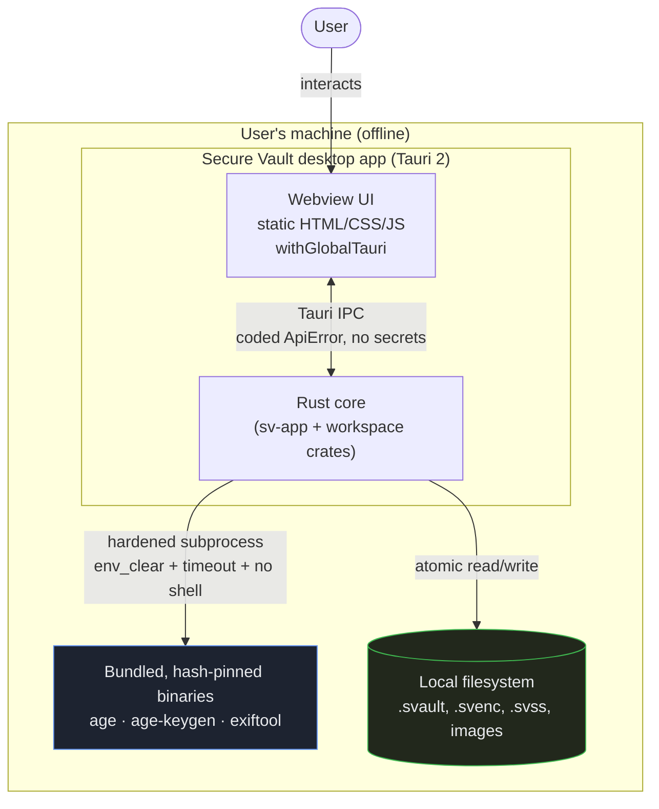
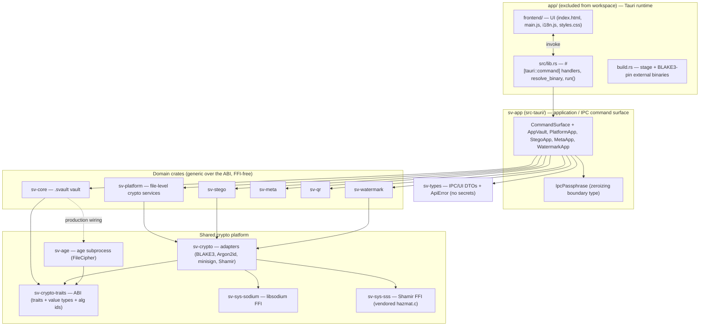

# 1. System Overview

## 1.1 Purpose

**Secure Vault** is an **offline-first desktop Security & Privacy Toolkit**. Its founding feature is
an **encrypted container** (the *Secure Vault* module), and it has since grown into a toolkit of six
user-facing security modules built over one shared cryptographic platform. The product assembles
**vetted, evaluated cryptographic primitives** rather than rolling bespoke cryptography.

The product is built and shipped from `secure-vault/`. (The surrounding repository also serves as a
*research evidence base* — topic directories of cloned upstream tools under evaluation — but that
material is not part of the shipped application and is outside the scope of this package.)

## 1.2 What the system does (implemented modules)

All six target modules have at least one feature exposed **standalone** (vault-independent). Each
maps to one or more IPC commands and one or more UI screens.

| Module | Implemented features | Backing crate(s) | Crypto / engine |
|--------|----------------------|------------------|-----------------|
| **Secure Vault** | Create / unlock / lock vault; add & extract items; change passphrase; integrity check; split & recover master key | `sv-core`, `sv-age` | Argon2id KEK → `secretbox`-wrapped keys; payload encrypted with `age`; signed with Ed25519-minisign |
| **Cryptography** | Encrypt / Decrypt file; Sign file; Verify signature; Hash file; Verify integrity; generate signing keypair | `sv-platform` | Argon2id + `secretbox` (file encryption); BLAKE3 (hash); Ed25519-minisign (sign/verify) |
| **Secret Sharing** | Split / recover a secret or file (k-of-n); Secure QR transfer of pieces | `sv-platform`, `sv-qr` | Shamir `sss` over a random DEK; `secretbox` payload; pure-Rust QR codec |
| **Steganography** | Hide / extract data in images; detect hidden data | `sv-stego` | Encrypt-then-embed (Argon2id + `secretbox`); LSB (PNG/BMP) + JPEG-DCT carriers; heuristic detectors |
| **Watermarking** | Embed / verify an invisible, fragile, keyed tamper-evidence mark | `sv-watermark` | Per-block BLAKE3 keyed-MAC in LSB plane; Argon2id key |
| **Analysis** | Inspect / sanitize / compare file metadata | `sv-meta` | Bundled, hash-pinned **ExifTool** subprocess |

> **Status (per `CLAUDE.md` discipline):** all six modules are **Implemented** (gate-passing code
> exists). The vault is **not yet a consumer** of `sv-platform` (a tracked refactor), and several
> research families — robust/visible watermarking, QR for non-share secrets — are **deferred
> research**, not implemented.

## 1.3 Technology stack (verified)

| Layer | Choice | Evidence |
|-------|--------|----------|
| Desktop shell | **Tauri 2** | [app/Cargo.toml](../../app/Cargo.toml), [app/tauri.conf.json:2](../../app/tauri.conf.json#L2) |
| Frontend | Static HTML/CSS/JS, **`withGlobalTauri: true`** (no bundler), CSP forbids inline scripts | [app/tauri.conf.json:10](../../app/tauri.conf.json#L10), [:23](../../app/tauri.conf.json#L23) |
| Core language | **Rust**, edition 2021, **MSRV 1.96** | [Cargo.toml](../../Cargo.toml) `rust-version = "1.96"` |
| Workspace | Cargo workspace, 13 members; `app/` **excluded** | [Cargo.toml](../../Cargo.toml) `members` / `exclude = ["app"]` |
| Serialization | **CBOR** (`ciborium`) for the authenticated vault header; `serde` JSON over IPC | [Cargo.toml](../../Cargo.toml), [crates/sv-core/src/format.rs](../../crates/sv-core/src/format.rs) |
| Hashing / KDF | **BLAKE3** (`blake3`), **Argon2id** (`argon2`) | [crates/sv-crypto/Cargo.toml](../../crates/sv-crypto/Cargo.toml) |
| AEAD / signing / sharing | **libsodium** `secretbox` (XSalsa20-Poly1305) + Ed25519; **Shamir** (`sss` hazmat) — both via FFI | [crates/sv-sys-sodium](../../crates/sv-sys-sodium), [crates/sv-sys-sss](../../crates/sv-sys-sss) |
| File encryption | **`age`** v1 (X25519 + ChaCha20-Poly1305), driven as a subprocess | [crates/sv-age/src/lib.rs](../../crates/sv-age/src/lib.rs) |
| Metadata | **ExifTool** (Perl) subprocess | [crates/sv-meta/src/lib.rs](../../crates/sv-meta/src/lib.rs) |
| Image codecs | `image` 0.25 (PNG/BMP/JPEG), `dct-io` (JPEG coefficients), `qrcode` + `rqrr` (QR) | per-module `Cargo.toml` |

## 1.4 System context

**Key context facts**

- **Fully offline.** There is no network client in the application graph; the CSP is `default-src
  'self'` ([app/tauri.conf.json:23](../../app/tauri.conf.json#L23)). All operations are local
  file operations and local subprocesses.
- **Single user, single machine.** No server, no accounts, no sync. The unit of sharing is a file
  (a `.svault` container, an encrypted artifact, or Shamir pieces) the user moves manually.
- **External binaries are part of the bundle**, not system dependencies: `age`, `age-keygen`, and
  `exiftool` are bundled and **BLAKE3-hash-pinned** at build time
  ([app/build.rs](../../app/build.rs)) and resolved from app resources at runtime
  ([app/src/lib.rs](../../app/src/lib.rs)).

## 1.5 High-level component map

A detailed dependency graph and the rationale for each boundary are in
[03-system-architecture.md](03-system-architecture.md).

## 1.6 Deployment posture

- **Build:** `cargo tauri build` from `app/` produces a per-OS bundle; `build.rs` stages and
  pins the external binaries, which ship via `bundle.resources: ["binaries/**/*"]`
  ([app/tauri.conf.json:36](../../app/tauri.conf.json#L36)).
- **`bundle.active: true`, `targets: "all"`** ([:27](../../app/tauri.conf.json#L27),
  [:28](../../app/tauri.conf.json#L28)) — bundling is enabled.
- **Internal-use posture.** The emitted bundle is **unsigned/unnotarized** (carry-forward blocker
  **H5**). Signing/notarization for public distribution is explicitly **out of scope** for this
  internal-use tool; see [docs/SIGNING-REQUIREMENTS.md](../SIGNING-REQUIREMENTS.md).
- **CI** validates fmt/clippy/build/test/deny on Linux, macOS, and Windows
  ([.github/workflows/ci.yml](../../.github/workflows/ci.yml)); see
  [08-testing-and-validation.md](08-testing-and-validation.md).
