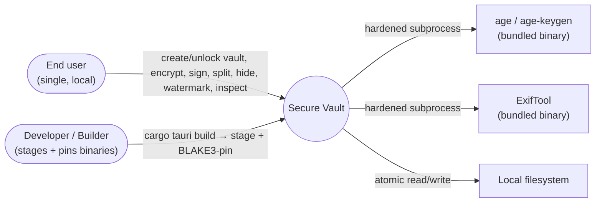

# 2. Requirements Analysis

This section reconstructs the requirements **as embodied by the implementation** and the frozen
design docs (`docs/M0-CONTRACTS.md`, `M5-SCHEMA-DECISIONS.md`, `M6-IPC-DECISIONS.md`,
`M7-HARDENING.md`). Each requirement is traceable to code; the trace tables cite `file:line`.

## 2.1 Actors

- **End user** — the only runtime human actor; operates entirely offline on one machine.
- **Developer/Builder** — supplies and pins the external binaries at build time (a build-time, not
  runtime, actor).
- **External binaries** (`age`, `age-keygen`, `exiftool`) and the **filesystem** are non-human
  actors the core drives across trust boundaries.

## 2.2 Functional requirements

> Legend: **R**equirement · backing **command(s)** · **evidence**.

### Vault (Secure Vault module)

| ID | Requirement | Command(s) | Evidence |
|----|-------------|-----------|----------|
| FR-V1 | Create an encrypted vault with a passphrase and optional recovery policy | `vault_create` | [src-tauri/src/service.rs](../../src-tauri/src/service.rs), [crates/sv-core/src/service.rs:23](../../crates/sv-core/src/service.rs#L23) |
| FR-V2 | Unlock a vault to an opaque session; lock to wipe keys | `vault_unlock`, `vault_lock` | [crates/sv-core/src/service.rs:30](../../crates/sv-core/src/service.rs#L30), [:33](../../crates/sv-core/src/service.rs#L33) |
| FR-V3 | Change passphrase (re-wrap keys, no payload re-encryption) | `vault_change_passphrase` | [crates/sv-core/src/service.rs:37](../../crates/sv-core/src/service.rs#L37) |
| FR-V4 | List, add, and extract items | `item_list`, `item_add`, `item_extract` | [crates/sv-core/src/service.rs:53](../../crates/sv-core/src/service.rs#L53)–69 |
| FR-V5 | Report non-secret vault metadata; export signing public key | `vault_meta`, `export_signing_public_key` | [crates/sv-core/src/service.rs:46](../../crates/sv-core/src/service.rs#L46), [:50](../../crates/sv-core/src/service.rs#L50) |
| FR-V6 | Verify container integrity + authenticity | `integrity_check` | [crates/sv-core/src/container.rs:113](../../crates/sv-core/src/container.rs#L113) |
| FR-V7 | Split / recover the vault master key (k-of-n) | `keys_split`, `keys_recover` | [crates/sv-core/src/service.rs:92](../../crates/sv-core/src/service.rs#L92), [:100](../../crates/sv-core/src/service.rs#L100) |

### Cryptography module (vault-free)

| ID | Requirement | Command(s) | Evidence |
|----|-------------|-----------|----------|
| FR-C1 | Hash any file (streaming BLAKE3) | `integrity_hash_file` | [crates/sv-platform/src/integrity.rs:20](../../crates/sv-platform/src/integrity.rs#L20) |
| FR-C2 | Verify a detached signature | `integrity_verify_signature` | [crates/sv-platform/src/integrity.rs:39](../../crates/sv-platform/src/integrity.rs#L39) |
| FR-C3 | Verify integrity by hash and/or signature (independent opt-in checks) | `integrity_verify_integrity` | [crates/sv-platform/src/integrity.rs:71](../../crates/sv-platform/src/integrity.rs#L71) |
| FR-C4 | Encrypt / decrypt a file with a passphrase | `crypto_encrypt_file`, `crypto_decrypt_file` | [crates/sv-platform/src/crypto.rs:21](../../crates/sv-platform/src/crypto.rs#L21), [:39](../../crates/sv-platform/src/crypto.rs#L39) |
| FR-C5 | Generate a signing keypair (secret key encrypted at rest); sign a file | `crypto_generate_signing_keypair`, `crypto_sign_file` | [crates/sv-platform/src/crypto.rs:57](../../crates/sv-platform/src/crypto.rs#L57), [:97](../../crates/sv-platform/src/crypto.rs#L97) |

### Secret Sharing module (vault-free)

| ID | Requirement | Command(s) | Evidence |
|----|-------------|-----------|----------|
| FR-S1 | Split a typed secret (k-of-n), returning copy-paste piece strings | `shares_split_secret` | [crates/sv-platform/src/sharing.rs:476](../../crates/sv-platform/src/sharing.rs#L476) |
| FR-S2 | Split a file (k-of-n); pieces travel as files | `shares_split_file` | [crates/sv-platform/src/sharing.rs:499](../../crates/sv-platform/src/sharing.rs#L499) |
| FR-S3 | Recover from piece files and/or pasted strings | `shares_recover_secret` | [crates/sv-platform/src/sharing.rs:574](../../crates/sv-platform/src/sharing.rs#L574) |
| FR-S4 | Export pieces as QR PNGs; recover from QR images | `shares_export_qr`, `shares_recover_from_qr` | [crates/sv-qr/src/lib.rs:77](../../crates/sv-qr/src/lib.rs#L77), [:110](../../crates/sv-qr/src/lib.rs#L110) |

### Steganography module (vault-free)

| ID | Requirement | Command(s) | Evidence |
|----|-------------|-----------|----------|
| FR-G1 | Encrypt-then-hide a payload in an image cover (PNG/BMP/JPEG) | `stego_hide` | [crates/sv-stego/src/pipeline.rs:73](../../crates/sv-stego/src/pipeline.rs#L73) |
| FR-G2 | Extract + decrypt a payload (oracle-safe) | `stego_extract` | [crates/sv-stego/src/pipeline.rs:144](../../crates/sv-stego/src/pipeline.rs#L144) |
| FR-G3 | Heuristically detect hidden data; never assert "clean" | `stego_detect` | [crates/sv-stego/src/detect/mod.rs:84](../../crates/sv-stego/src/detect/mod.rs#L84) |

### Watermarking module (vault-free)

| ID | Requirement | Command(s) | Evidence |
|----|-------------|-----------|----------|
| FR-W1 | Embed an invisible, keyed, fragile tamper-evidence mark | `watermark_embed` | [crates/sv-watermark/src/lib.rs:99](../../crates/sv-watermark/src/lib.rs#L99) |
| FR-W2 | Verify a mark: Intact / Tampered (localized) / NotWatermarked | `watermark_verify` | [crates/sv-watermark/src/lib.rs:151](../../crates/sv-watermark/src/lib.rs#L151) |

### Analysis module (vault-free)

| ID | Requirement | Command(s) | Evidence |
|----|-------------|-----------|----------|
| FR-A1 | Inspect embedded metadata | `metadata_inspect` | [crates/sv-meta/src/lib.rs](../../crates/sv-meta/src/lib.rs) `inspect` |
| FR-A2 | Sanitize (strip) metadata; report honest guarantee per format | `metadata_sanitize` | [crates/sv-meta/src/lib.rs](../../crates/sv-meta/src/lib.rs) `sanitize` |
| FR-A3 | Compare embedded metadata of two files | `metadata_diff` | [crates/sv-meta/src/lib.rs](../../crates/sv-meta/src/lib.rs) `diff` |
| FR-A4 | Report whether the Analysis module is available (fail-closed) | `metadata_available` | [src-tauri/src/meta.rs:70](../../src-tauri/src/meta.rs#L70) |

**Total: 38 IPC commands** registered in the Tauri invoke handler
([app/src/lib.rs](../../app/src/lib.rs) `generate_handler!`).

## 2.3 Non-functional requirements

| ID | Category | Requirement | How it is met (evidence) |
|----|----------|-------------|--------------------------|
| NFR-1 | **Confidentiality** | No secret material crosses the IPC boundary or appears in a DTO | `sv-types` contains no secret-bearing types ([crates/sv-types/src/lib.rs:5](../../crates/sv-types/src/lib.rs#L5)); secret value types are non-`Serialize` ([crates/sv-crypto-traits/src/lib.rs:153](../../crates/sv-crypto-traits/src/lib.rs#L153)) |
| NFR-2 | **Confidentiality** | Secrets are zeroized; redacted in `Debug`; growth-proof | `Key32`/`KeyShare` `ZeroizeOnDrop`; `SecretBytes` is `Box<[u8]>` ([crates/sv-crypto-traits/src/lib.rs:153](../../crates/sv-crypto-traits/src/lib.rs#L153)–254) |
| NFR-3 | **Integrity/Authenticity** | Containers are authenticated (signed) and tamper-evident | Binding root `BLAKE3(header‖payload)` signed by Ed25519-minisign ([crates/sv-core/src/container.rs:231](../../crates/sv-core/src/container.rs#L231)) |
| NFR-4 | **Oracle-safety** | Credential failures are indistinguishable; benign conditions stay actionable | `AuthFailed → Unauthorized` merge ([crates/sv-core/src/error.rs:68](../../crates/sv-core/src/error.rs#L68)); stego no-payload/bad-frame/auth all → `Unauthorized` ([crates/sv-stego/src/error.rs](../../crates/sv-stego/src/error.rs)) |
| NFR-5 | **Availability / DoS resistance** | Bounded memory; refuse oversized inputs; bound wall-clock on subprocesses | `MAX_PLAINTEXT_BYTES = 2 GiB` ([crates/sv-platform/src/lib.rs:41](../../crates/sv-platform/src/lib.rs#L41)); `MAX_ITEM_BYTES = 2 GiB` ([src-tauri/src/service.rs:53](../../src-tauri/src/service.rs#L53)); age timeout 120 s ([crates/sv-age/src/lib.rs:50](../../crates/sv-age/src/lib.rs#L50)); decompression-bomb guards in image modules |
| NFR-6 | **Supply-chain integrity** | External binaries are byte-pinned; resolution surface is closed in release | BLAKE3 pins via `build.rs` `emit_pin`; release ignores `SV_*_BIN` overrides ([app/src/lib.rs:513](../../app/src/lib.rs#L513)) |
| NFR-7 | **Least privilege** | Subprocesses run with cleared environment, no shell, fixed working dir | `env_clear()` + Windows allow-list ([crates/sv-age/src/lib.rs:108](../../crates/sv-age/src/lib.rs#L108)); ExifTool `-config ""` disables config-as-code ([crates/sv-meta/src/lib.rs](../../crates/sv-meta/src/lib.rs)) |
| NFR-8 | **Offline-first** | No network dependency; CSP `default-src 'self'` | [app/tauri.conf.json:23](../../app/tauri.conf.json#L23) |
| NFR-9 | **Portability** | Builds + tests on Linux, macOS, Windows; MSRV 1.96 | CI 3-OS matrix ([.github/workflows/ci.yml](../../.github/workflows/ci.yml)); `rust-version = "1.96"` ([Cargo.toml](../../Cargo.toml)) |
| NFR-10 | **Data safety** | Never silently overwrite; atomic writes | `refuse_existing` → `OutputExists` ([crates/sv-platform/src/lib.rs:146](../../crates/sv-platform/src/lib.rs#L146)); same-dir temp + rename ([crates/sv-core/src/container.rs:333](../../crates/sv-core/src/container.rs#L333)) |
| NFR-11 | **Auditability** | Audited core is isolated from the heavy webview tree; `cargo deny`/`audit` gated | `app` excluded from workspace ([Cargo.toml](../../Cargo.toml) `exclude`); supply-chain CI job |
| NFR-12 | **Internationalization** | UI fully localized (Vietnamese default, English fallback) | [app/frontend/i18n.js](../../app/frontend/i18n.js) `DEFAULT_LANG = "vi"` |
| NFR-13 | **Crypto agility** | Algorithm identity is explicit at the trait boundary and on disk | `KdfAlg`/`HashAlg`/`AeadAlg`/`FileCipherAlg`/`SigAlg` enums + `CipherSuite::V1` ([crates/sv-crypto-traits/src/lib.rs:39](../../crates/sv-crypto-traits/src/lib.rs#L39), [crates/sv-core/src/format.rs:41](../../crates/sv-core/src/format.rs#L41)) |

## 2.4 Constraints (design rules, enforced)

- **No bespoke cryptography.** Only vetted primitives are assembled
  (`CLAUDE.md` Boundaries → Never).
- **Product code lives in `secure-vault/`**; new modules are added as peer domain crates +
  additive `CommandSurface` segments + UI modules over the shared platform — not as forks of the
  vault.
- **Additive IPC.** New commands are additive to `CommandSurface`; errors stay oracle-safe and
  coded; secrets stay zeroizing and never enter a DTO (`CLAUDE.md` Conventions).
- **`unsafe` is denied workspace-wide**, opted back in only at FFI crates
  ([Cargo.toml](../../Cargo.toml) `unsafe_code = "deny"`; `sv-sys-sodium`/`sv-sys-sss` `#![allow]`).
- **Versioned contracts.** `CONTRACT_VERSION` (IPC), `FORMAT_VERSION` (container structure), and
  `SUITE_VERSION` (crypto suite / KDF context) are distinct, explicit axes
  ([crates/sv-types/src/lib.rs:23](../../crates/sv-types/src/lib.rs#L23),
  [crates/sv-core/src/format.rs:35](../../crates/sv-core/src/format.rs#L35),
  [crates/sv-core/src/keys.rs:26](../../crates/sv-core/src/keys.rs#L26)).

## 2.5 Out of scope (explicit)

- **Public distribution / signing / notarization (H5).** Internal-use tool; Gatekeeper/SmartScreen
  acceptance is out of scope. See [docs/SIGNING-REQUIREMENTS.md](../SIGNING-REQUIREMENTS.md).
- **Streaming encryption (H1).** The pipeline buffers in memory and bounds inputs at 2 GiB rather
  than streaming; tracked, not closed.
- **Multi-process vault locking.** A single process serializes per-vault writes
  ([src-tauri/src/service.rs:104](../../src-tauri/src/service.rs#L104)); cross-process locking is
  not implemented.
- **Robust / visible watermarking; QR for non-share secrets.** Deferred research.
