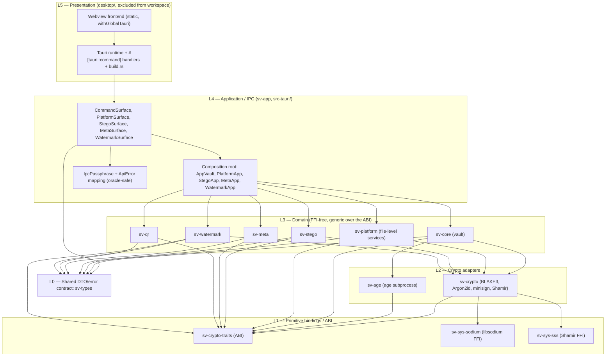
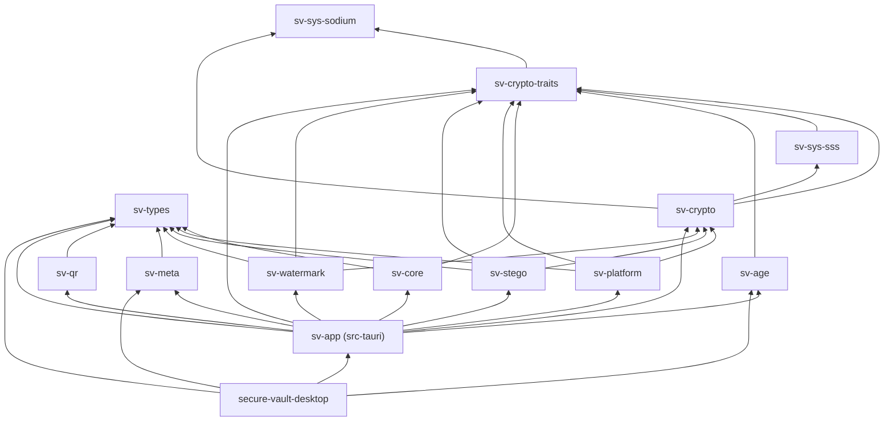
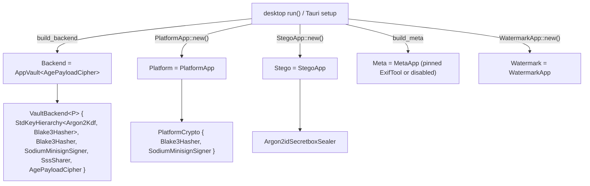
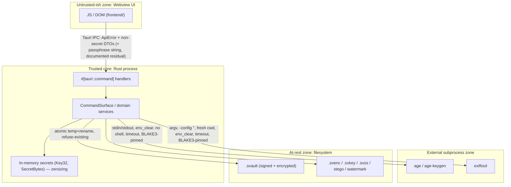

# 3. System Architecture

## 3.1 Architectural style

Secure Vault is a **layered, dependency-injected, modular monolith** packaged as a desktop
application:

- **Hexagonal / ports-and-adapters at the crypto core.** A backend-free **ABI** crate
  (`sv-crypto-traits`) defines *ports* (traits + value types); `sv-crypto` and `sv-age` are the
  *adapters*. Domain crates depend on the ABI and are generic over it, so their production graph
  stays FFI-free ([crates/sv-core/src/lib.rs:9](../../crates/sv-core/src/lib.rs#L9)).
- **A composition root** (`sv-app`, in `src-tauri/`) wires concrete adapters into domain services and
  exposes them behind a single `CommandSurface`.
- **A thin runtime shell** (`desktop/`) hosts the webview UI, registers the Tauri commands, and owns
  the external-binary lifecycle (staging, pinning, resolution).

## 3.2 Layers

## 3.3 Crate inventory and responsibilities

| Crate | Layer | Responsibility | `unsafe`? |
|-------|-------|----------------|-----------|
| **sv-types** | L0 | Public IPC/UI DTOs + coded `ApiError`. **No secret material.** `CONTRACT_VERSION = 1` | denied |
| **sv-crypto-traits** | L1 | Stable ABI: `Hasher`, `KeyDerivation`, `Kdf`, `Signer`, `SecretSharer`, `FileCipher`; value types (`Key32`, `SecretBytes`, `KeyShare`, `Hash32`, `Salt`, …); algorithm-id enums; `CryptoError` | `#![forbid]` |
| **sv-sys-sodium** | L1 | Safe wrappers over libsodium: `crypto_sign`, `crypto_generichash` (BLAKE2b), `crypto_secretbox`; `sodium_init` guard | `#![allow]` (FFI) |
| **sv-sys-sss** | L1 | FFI to Daan Sprenkels' `sss` hazmat (vendored `hazmat.c`); Rust-supplied `randombytes` shim | `#![allow]` (FFI) |
| **sv-crypto** | L2 | Concrete adapters: `Blake3Hasher`, `Argon2Kdf`, `SodiumMinisignSigner`, `SssSharer`; `secretbox` wrap/open; Argon2id `policy`. Re-exports the ABI | `#![forbid]` |
| **sv-age** | L2 | `FileCipher` adapter driving a hash-pinned `age` CLI as a hardened subprocess | none in crate logic |
| **sv-core** | L3 | `.svault` container format, key hierarchy, session API, errors. **Generic over the ABI; FFI-free** | denied |
| **sv-platform** | L3 | Vault-free file-level services: hash/verify/integrity/encrypt/decrypt/sign + Shamir split/recover | denied |
| **sv-stego** | L3 | Image steganography: encrypt-then-embed + heuristic detection | denied |
| **sv-meta** | L3 | Metadata inspect/sanitize/diff via a hash-pinned ExifTool subprocess | denied |
| **sv-qr** | L3 | Pure-Rust QR codec (text ⇄ QR PNG); transport-only | denied |
| **sv-watermark** | L3 | Invisible, keyed, fragile tamper-evidence watermark | denied |
| **sv-app** (`src-tauri/`) | L4 | `CommandSurface` + composition root; `IpcPassphrase`; `ApiError` mapping | denied |
| **secure-vault-desktop** (`desktop/`) | L5 | Tauri runtime, UI, `#[tauri::command]` handlers, `build.rs` binary staging/pinning. **Excluded from the workspace** | denied |

## 3.4 Dependency graph (production)

*Arrows point from a crate to a crate it depends on.* Notes verified against the manifests:

- **`sv-core` does not depend on `sv-crypto` in production** — only on `sv-crypto-traits`. It pulls
  `sv-crypto` as a **dev-dependency** to exercise the generic key hierarchy in tests
  ([crates/sv-core/Cargo.toml](../../crates/sv-core/Cargo.toml)). The concrete adapters (`Argon2Kdf`,
  `Blake3Hasher`, `AgePayloadCipher`, …) are injected by the composition root.
- **`age` is wired only in the composition root** (`sv-app` → `AgePayloadCipher`), keeping the
  subprocess dependency out of the domain layer ([src-tauri/src/payload.rs](../../src-tauri/src/payload.rs)).
- **`desktop/` is `exclude`d from the workspace** so the Tauri/webview tree never enters the audited
  core's lock/deny/build gates ([Cargo.toml](../../Cargo.toml)).

## 3.5 Composition root

The runtime wiring lives in [desktop/src/lib.rs](../../desktop/src/lib.rs) `run()` and the `sv-app`
constructors. Five managed states are registered:

- `VaultBackend<P: PayloadCipher>` is generic over the payload cipher so the full lifecycle is
  testable with an in-memory `StubPayloadCipher`; production uses `AgePayloadCipher`
  ([src-tauri/src/service.rs:71](../../src-tauri/src/service.rs#L71),
  [src-tauri/src/payload.rs:28](../../src-tauri/src/payload.rs#L28)).
- `build_backend` resolves + **hash-verifies** `age`/`age-keygen`; a release build refuses to run
  unpinned ([desktop/src/lib.rs:429](../../desktop/src/lib.rs#L429)).
- `build_meta` resolves + pins ExifTool, or returns `MetaApp::disabled()` (fail-closed) if it is
  absent or fails the pin in a release build ([desktop/src/lib.rs:463](../../desktop/src/lib.rs#L463)).

## 3.6 Trust boundaries

| # | Boundary | What crosses | Control |
|---|----------|--------------|---------|
| **TB-1** | Webview ↔ Rust core (Tauri IPC) | Plain-string paths + non-secret DTOs out; coded `ApiError` back; **passphrase** in as `IpcPassphrase` | No secret in any DTO ([crates/sv-types/src/lib.rs:5](../../crates/sv-types/src/lib.rs#L5)); passphrase zeroized at the boundary, **documented upstream residual** ([src-tauri/src/passphrase.rs](../../src-tauri/src/passphrase.rs)) |
| **TB-2** | Core ↔ external binary (subprocess) | Plaintext/ciphertext via stdin/stdout (age); file paths via argv (exiftool) | BLAKE3 pin, `env_clear` + minimal allow-list, no shell, wall-clock timeout, fresh working dir |
| **TB-3** | Core ↔ filesystem (at rest) | `.svault` and artifacts | Container authenticated (signed binding root) + encrypted; atomic writes; refuse-overwrite |
| **TB-4** | Audited core ↔ webview dependency tree | (build-time) | `desktop/` excluded from workspace so `cargo deny`/`audit` gate only the audited core |

A full threat model is in [06-security-design.md](06-security-design.md).

## 3.7 Cross-cutting contracts

- **`ApiError` (oracle-safe, coded).** Twelve stable machine codes (`SV-…`); credential failures
  merge to `SV-UNAUTHORIZED`; benign conditions stay distinct and actionable
  ([crates/sv-types/src/lib.rs:455](../../crates/sv-types/src/lib.rs#L455)). Detail strings never
  carry secrets or filesystem paths (`io_generic`).
- **`IpcPassphrase`.** Zeroizing newtype that converts to `SecretBytes` on the first line of every
  handler ([src-tauri/src/passphrase.rs:22](../../src-tauri/src/passphrase.rs#L22)).
- **Versioning.** `CONTRACT_VERSION` (IPC), `FORMAT_VERSION` (container structure), and
  `SUITE_VERSION` (crypto suite + key-derivation context) evolve independently.
- **Status discipline.** Capabilities are labeled Implemented / Implemented-vault-bound / Planned /
  Research (`CLAUDE.md`).
