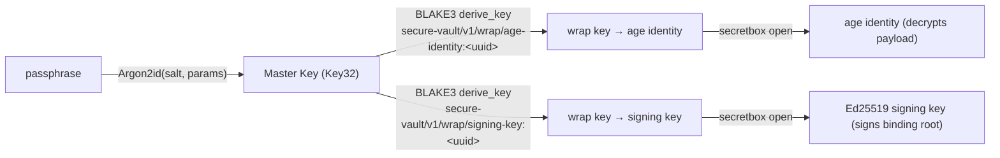
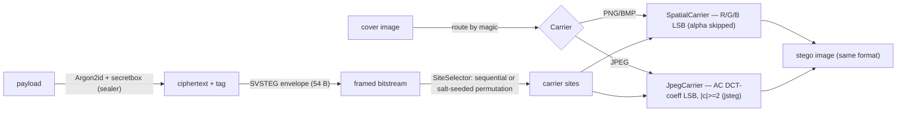

# 4. Module Design

This section documents the design of each major crate/feature: its public surface, the algorithm it
implements, and its security claims (and explicit non-claims). All signatures are quoted from source.

---

## 4.1 Crypto platform — ABI and adapters

### 4.1.1 `sv-crypto-traits` (the ABI)

The stable, dependency-light contract layer (`serde`, `zeroize`, `thiserror` only). It owns the
traits, the value types, the algorithm-id enums, and `CryptoError`
([crates/sv-crypto-traits/src/lib.rs](../../crates/sv-crypto-traits/src/lib.rs)).

**Traits** (lines 283–376):

| Trait | Methods | Purpose |
|-------|---------|---------|
| `Hasher` | `alg`, `hash`, `keyed_hash`, `streaming` | BLAKE3 content hashing / MAC |
| `KeyDerivation` | `derive_key(context, ikm) -> Key32` | Domain-separated subkey derivation (kept **separate** from `Hasher`) |
| `StreamingHasher` | `update`, `finalize` | Incremental hashing of large inputs |
| `Kdf` | `alg`, `derive(passphrase, salt, params) -> Result<Key32, _>` | Argon2id passphrase KDF |
| `Signer` | `alg`, `generate`, `sign`, `verify` | Ed25519-in-minisign signatures |
| `SecretSharer` | `split(key, n, k)`, `combine(shares)` | Shamir over a 32-byte key |
| `FileCipher` | `alg`, `encrypt`, `decrypt` | Streaming file cipher (age) |

**Value types** and their security posture (lines 76–254):

| Type | Shape | Secret? | Zeroize | Redacted `Debug` | `Serialize` |
|------|-------|---------|---------|------------------|-------------|
| `Key32` | `[u8; 32]` | ✅ | `ZeroizeOnDrop` | ✅ | ❌ |
| `KeyShare` | `[u8; 33]` | ✅ | `ZeroizeOnDrop` | ✅ | ❌ |
| `SecretBytes` | `Box<[u8]>` (no spare capacity) | ✅ | `Drop` → `zeroize` | ✅ | ❌ |
| `AgeIdentity` | wraps `SecretBytes` | ✅ | via `SecretBytes` | ✅ | ❌ |
| `Hash32` | `[u8; 32]` | ❌ | — | — | ✅ |
| `Salt` | `[u8; 16]` | ❌ | — | — | ✅ |
| `Ed25519PublicKey` | `[u8; 32]` | ❌ | — | — | ✅ |
| `MinisignSignature` | `Vec<u8>` | ❌ | — | — | ✅ |
| `AgeRecipient` | `String` (`age1…`) | ❌ | — | — | ✅ |

Constants: `HASH_LEN = KEY_LEN = 32`, `SALT_LEN = 16`, `KEYSHARE_LEN = 33` (the single canonical
definition; `sv-sys-sss` asserts equality with the C header). Algorithm-id enums (lines 39–70):
`KdfAlg::Argon2id`, `HashAlg::Blake3`, `AeadAlg::XSalsa20Poly1305`, `FileCipherAlg::AgeV1`,
`SigAlg::Ed25519Minisign`. `KdfParams` is a forward-compatible enum (`KdfParams::Argon2id(Argon2idParams)`).

### 4.1.2 `sv-crypto` (adapters)

Re-exports the ABI and provides the concrete unit-struct adapters
([crates/sv-crypto/src/lib.rs](../../crates/sv-crypto/src/lib.rs)):

| Adapter | Implements | Backend |
|---------|-----------|---------|
| `Blake3Hasher` | `Hasher` + `KeyDerivation` | `blake3` crate (`derive_key` for subkeys) |
| `Argon2Kdf` | `Kdf` | `argon2` crate, Argon2id, `V0x13` |
| `SodiumMinisignSigner` | `Signer` | libsodium (`crypto_sign`) + minisign on-disk format |
| `SssSharer` | `SecretSharer` | `sv-sys-sss` (vendored hazmat) |

- **`secretbox`** wrap/open (XSalsa20-Poly1305) for KEK/SWK wrapping
  ([crates/sv-crypto/src/secretbox.rs](../../crates/sv-crypto/src/secretbox.rs)).
- **`minisign`** module: Ed25519 detached signatures, message prehashed with BLAKE2b-512, deterministic
  8-byte key id, trusted-comment binding ([crates/sv-crypto/src/minisign.rs](../../crates/sv-crypto/src/minisign.rs)).
- **Argon2id policy** ([crates/sv-crypto/src/policy.rs](../../crates/sv-crypto/src/policy.rs)):
  - `recommended()` → 256 MiB / 3 passes / 1 lane (`Argon2idParams::default`,
    [crates/sv-crypto-traits/src/lib.rs:96](../../crates/sv-crypto-traits/src/lib.rs#L96)).
  - Policy floor: `MIN_MEM_KIB = 19_456` (OWASP), `MIN_TIME_COST = 2`; `calibrate` raises the time
    cost toward a target duration up to `MAX_CALIBRATED_TIME_COST = 24`.

### 4.1.3 `sv-sys-sodium` / `sv-sys-sss` (FFI)

- **`sv-sys-sodium`** wraps libsodium with a `sodium_init` `Once` guard (panics if init fails) and
  exposes `random_bytes`, `sign_keypair`/`sign_detached`/`sign_verify_detached`, `blake2b`
  (`crypto_generichash`), and `secretbox_seal`/`secretbox_open`. Each `unsafe` block carries a
  `// SAFETY:` note ([crates/sv-sys-sodium/src/lib.rs](../../crates/sv-sys-sodium/src/lib.rs)).
- **`sv-sys-sss`** compiles vendored `hazmat.c` via `cc`, renaming C's `randombytes` to
  `sv_sss_randombytes` (a `getrandom`-backed shim) to avoid a duplicate-symbol clash with libsodium.
  A `const _: () = assert!(KEYSHARE_LEN == 33)` ties the Rust constant to the C header
  ([crates/sv-sys-sss/src/lib.rs](../../crates/sv-sys-sss/src/lib.rs),
  [crates/sv-sys-sss/build.rs](../../crates/sv-sys-sss/build.rs)).

### 4.1.4 `sv-age` (FileCipher over the age subprocess)

`age` is pure Go with no FFI surface, so it is driven as a hardened subprocess
([crates/sv-age/src/lib.rs](../../crates/sv-age/src/lib.rs)):

- `AgeCipher::new_pinned(binary, pinned_blake3_hex)` reads the binary, computes BLAKE3, and rejects a
  mismatch with `HashMismatch` (line 62).
- `run()` spawns with `Command::env_clear()` (line 108); on Windows it re-adds only
  `SystemRoot`/`SystemDrive`/`TEMP`/`TMP` for the loader/CSPRNG (line 113) — this is the empirical
  **H4** path validated on Windows CI.
- A **wall-clock timeout** (`DEFAULT_TIMEOUT = 120 s`, line 50) is enforced with a reader thread +
  `recv_timeout`; on expiry the child is killed and `TimedOut` returned (lines 147–159).
- The age **identity** (secret) is written to a `0600` temp file passed via `-i`, then best-effort
  overwritten and unlinked on drop (lines 246–275). Plaintext/identity buffers are `zeroize`d.
- `FileCipher::decrypt` maps a non-zero exit to `CryptoError::VerificationFailed` (wrong identity /
  corrupt), so the vault layer can render tamper distinctly.

---

## 4.2 Secure Vault (`sv-core`)

The encrypted-container domain crate. **Generic over the ABI and FFI-free**; concrete adapters are
injected by the composition root.

**Session API** (`VaultService` trait, [crates/sv-core/src/service.rs:20](../../crates/sv-core/src/service.rs#L20)):
`create`, `unlock`, `lock`, `change_passphrase`, `vault_meta`, `export_signing_public_key`,
`list_items`, `add_item`, `extract_item`, `integrity_check`, `hash_file`, `sign_file`, `verify_file`,
`split_key`, `recover`.

**Key hierarchy** ([crates/sv-core/src/keys.rs](../../crates/sv-core/src/keys.rs)):

- `StdKeyHierarchy<K: Kdf, D: KeyDerivation>` derives the master key (Argon2id) then per-field wrap
  keys (BLAKE3 `derive_key` with a vault-UUID-bound context, `SUITE_VERSION = 1`).
- The master key is the **only** persistent in-session secret (`SessionState { master_key, vault_path }`,
  [src-tauri/src/service.rs:62](../../src-tauri/src/service.rs#L62)); the age identity and signing key are
  unwrapped transiently per operation.

The on-disk container format and item model are detailed in [05-data-design.md](05-data-design.md).
`change_passphrase` re-derives and re-wraps the keys only — it does **not** re-encrypt the payload.

---

## 4.3 Cryptography & Integrity services (`sv-platform`)

A **vault-free, session-free** crypto-services layer over the shared adapters, exposed via
`PlatformCrypto` ([crates/sv-platform/src/lib.rs:88](../../crates/sv-platform/src/lib.rs#L88)).

| Operation | Signature (abridged) | Engine |
|-----------|----------------------|--------|
| `hash_file(path) -> String` | streaming BLAKE3 → hex | `Blake3Hasher` |
| `verify_signature(file, sig, pk) -> SignatureCheck` | minisign verify | `SodiumMinisignSigner` |
| `verify_integrity(file, hash?, sig?, pk?) -> IntegrityVerification` | hash and/or signature, **independent opt-in** | BLAKE3 + Ed25519 |
| `encrypt_file / decrypt_file(in, out, passphrase) -> String` | `.svenc` artifact | Argon2id + `secretbox` |
| `generate_signing_keypair(dir, name, passphrase) -> PlatformKeypair` | `.svkey` (secret encrypted at rest) | Ed25519 |
| `sign_file(in, key, passphrase) -> String` | `.minisig` | Ed25519 |
| `split_secret / split_file(…, n, k, dir) -> ShareSplitOutput` | Shamir + `secretbox` | `SssSharer` |
| `recover_secret(pieces, payload, out) -> RecoverOutput` | reconstruct + open | `SssSharer` |

> **Important:** the Cryptography module's *Encrypt/Decrypt File* uses **Argon2id + `secretbox`**
> (the `SVENC` artifact), **not** `age`. `age` is a **vault-only** concern. `sv-platform` is entirely
> pure-Rust + libsodium FFI; no external binary is involved.

**Memory & data-safety guards**: `MAX_PLAINTEXT_BYTES = 2 GiB`
([crates/sv-platform/src/lib.rs:41](../../crates/sv-platform/src/lib.rs#L41)); `read_capped`
stat-then-cap-then-read; `write_atomic` (temp + `sync_all` + rename); `refuse_existing` →
`OutputExists`. Hashing **streams** and is not bound by the 2 GiB cap.

**Integrity composition** ([crates/sv-platform/src/integrity.rs:71](../../crates/sv-platform/src/integrity.rs#L71)):
`verify_integrity` requires at least one of hash/signature; a signature request needs both the
`.sig` and the public-key path; when both hash and signature are checked the file is read/hashed
once. A check that was not requested is reported `*_checked = false` and never counts as a pass.

**Secret-sharing engine** ([crates/sv-platform/src/sharing.rs](../../crates/sv-platform/src/sharing.rs)):
a hybrid scheme — a random 32-byte DEK is Shamir-split (`sss`), and the DEK (via a group-bound BLAKE3
subkey) `secretbox`-encrypts the payload. Piece file `SVSSS` (92 bytes) + payload `SVSSP`; the
`payload_ref` (BLAKE3 of the payload) binds each piece to its payload, and `(group_id, n, k)` are
folded into the payload-key derivation so any header tamper fails the AEAD. Threshold `1 ≤ k ≤ n`;
recovery gates on agreement, duplicate-x detection, non-zero-x, count, payload binding, then combine.
See [05-data-design.md](05-data-design.md).

---

## 4.4 Steganography (`sv-stego`)

Image-cover hide/extract with **encrypt-then-embed**, plus a heuristic detection panel
([crates/sv-stego/src](../../crates/sv-stego/src)).

- **Security boundary = the sealer**, not concealment. The `Argon2idSecretboxSealer` reuses the
  `sv-crypto` stack (Argon2id KDF + XSalsa20-Poly1305, 24-byte nonce, 16-byte tag). *“No new
  cryptographic primitive is introduced here”* ([seal.rs:6](../../crates/sv-stego/src/seal.rs#L6)).
- **Envelope** `SVSTEG` (54 bytes): magic, version, flags (carrier + selector bits), kdf/aead ids,
  16-byte salt (seeds the KDF **and** the permutation), 24-byte nonce, 4-byte ciphertext length
  ([envelope.rs](../../crates/sv-stego/src/envelope.rs)).
- **Spatial carrier** — PNG/BMP only; embeds in R/G/B LSBs (alpha skipped); re-encodes losslessly.
- **JPEG carrier** — pure-Rust `dct-io`; embeds in luminance **AC** coefficient LSBs with `|c| ≥ 2`
  (jsteg rule; DC and `{0, ±1}` left untouched so the eligible set is invariant under writes);
  re-encodes entropy only, preserving quantization/Huffman tables.
- **Detection panel** ([detect/mod.rs](../../crates/sv-stego/src/detect/mod.rs)) fuses independent
  detectors into a `Suspicion` ladder by max score: **appended-data** (binwalk-lite),
  **chi-square** (Westfeld–Pfitzmann), **RS** (Fridrich–Goljan–Du), and **JPEG-DCT chi-square**.
  Levels: `NotObserved < Low < Elevated < High`.

**Security claims & non-claims** (quoted from [lib.rs](../../crates/sv-stego/src/lib.rs)):

- *“Concealment ≠ confidentiality”*; concealment **carries no security claim**.
- Extraction is **oracle-safe**: a clean image, wrong passphrase, tampered carrier, and truncated
  frame are **indistinguishable** — all collapse to `SV-UNAUTHORIZED`.
- Detection **never asserts an image is clean**; the lowest verdict is `NotObserved`, and the report
  carries a fixed caveat that absence of signal is not proof of absence. Low-rate, encrypted,
  permuted `sv-stego` payloads are honestly close to undetectable by these heuristics.

**Bounds:** file caps 64 MiB (cover + payload); `decode_bounded` enforces `MAX_DECODE_DIM = 30_000`
px and `MAX_DECODE_ALLOC = 1 GiB` against decompression bombs ([carrier/mod.rs](../../crates/sv-stego/src/carrier/mod.rs)).

---

## 4.5 Watermarking (`sv-watermark`)

An invisible, **keyed**, **fragile** (tamper-evident) mark — **not** steganography and **not** robust
([crates/sv-watermark/src/lib.rs](../../crates/sv-watermark/src/lib.rs)).

- Image divided into `16×16` blocks. Per-block tag
  `BLAKE3::keyed_hash(K, "sv-watermark-block-v1" ‖ W ‖ H ‖ bx ‖ by ‖ content)`, where `content` is
  the **upper 7 bits** of R/G/B (the LSB plane is excluded); tag tiled across the block's **blue-channel
  LSBs**.
- A content-independent **presence sentinel**
  `BLAKE3::keyed_hash(K, "sv-watermark-presence-v1" ‖ W ‖ H)` is tiled across **green-channel LSBs**;
  `≥ 75%` match means the key is present.
- Verdict: sentinel absent → `NotWatermarked`; present + all blocks match → `Intact`; present + ≥1
  block fails → `Tampered`. The sentinel lets a wholly-altered image still read `Tampered` rather
  than `NotWatermarked`.
- Key = Argon2id at the OWASP floor (no new primitive); the derived key is a zeroizing `WmKey`.
- **Lossless only** (PNG/BMP enforced by extension allow-list — a fragile LSB mark cannot survive
  JPEG); `MAX_DIM = 30_000`, `MAX_ALLOC = 1 GiB`, file cap 256 MiB; minimum image `16×16`.

**Non-claims:** fragile, *meant* to break on any edit; cannot survive lossy re-encoding; no proof of
origin (tamper-evidence relative to a key, not authorship).

---

## 4.6 Analysis (`sv-meta`)

Metadata inspect/sanitize/diff via a **bundled, hash-pinned ExifTool** subprocess
([crates/sv-meta/src/lib.rs](../../crates/sv-meta/src/lib.rs)).

- `ExifTool::new_pinned(binary, hash)` verifies BLAKE3; `inspect` runs `exiftool -config "" -j -G
  -struct -fast2 FILE` and parses the JSON; `sanitize` runs `-all= -o OUT IN` for natively-stripped
  families; `diff` compares embedded tags (file-system pseudo-groups excluded).
- **Hardening:** `-config ""` (first two argv tokens) disables ExifTool's executable-Perl config
  mechanism — the one attacker-controllable RCE surface; `env_clear` + minimal `PATH`; **no shell**;
  fresh throwaway working directory; 60 s wall-clock timeout; 8 GiB input cap.
- **Sanitize honesty:** native rewrite → `guaranteed: true`; PDF incremental → `guaranteed: false`
  (prior metadata recoverable); read-only families are **refused** (`SV-INVALID-INPUT`), never
  falsely reported as sanitized.
- **Fail-closed availability:** if ExifTool is absent (or unpinned in a release build), the
  composition root returns `MetaApp::disabled()`; every Analysis command then returns an internal
  "unavailable" error rather than acting as a user oracle, and the rest of the toolkit is unaffected
  ([src-tauri/src/meta.rs:48](../../src-tauri/src/meta.rs#L48)).

---

## 4.7 Secure QR transfer (`sv-qr`)

A generic, pure-Rust QR codec ([crates/sv-qr/src/lib.rs](../../crates/sv-qr/src/lib.rs)):

- `encode_text_to_png(text, out)` (via `qrcode`, error-correction level **H**, ≥512×512, quiet
  zone, refuse-overwrite); `decode_png` / `decode_png_all` (via `rqrr`, decoding **every** QR in an
  image).
- **Transport-only**: it knows nothing about secret sharing; a QR of a Shamir *piece* is non-secret
  ciphertext, so no secret enters this layer. Fails closed (`NoQrFound` / `NotAnImage`) — never a
  wrong result.
- Bounds: file cap 64 MiB, `MAX_DIM = 20_000`, `MAX_ALLOC = 512 MiB`.

---

## 4.8 Application / IPC surface (`sv-app`)

The composition root and command surface ([src-tauri/src](../../src-tauri/src)):

- `CommandSurface` (vault), `PlatformSurface`, `StegoSurface`, `MetaSurface`, `WatermarkSurface` —
  each handler converts `IpcPassphrase → SecretBytes` on entry and maps the domain error to
  `ApiError` (`.map_err(ApiError::from)`).
- `AppVault<P: PayloadCipher>` wraps `VaultBackend
`; production `P = AgePayloadCipher`, tests use
  `StubPayloadCipher` (deterministic, in-memory — no `age` binary required)
  ([src-tauri/src/payload.rs](../../src-tauri/src/payload.rs)).
- `VaultBackend` serializes per-vault writes with a canonicalized-path mutex map (**H7**) and guards
  item size at 2 GiB before reading ([src-tauri/src/service.rs:82](../../src-tauri/src/service.rs#L82),
  [:104](../../src-tauri/src/service.rs#L104)).

The full command catalog is in [02-requirements-analysis.md](02-requirements-analysis.md) §2.2; the
error model is in [06-security-design.md](06-security-design.md) §6.4.
