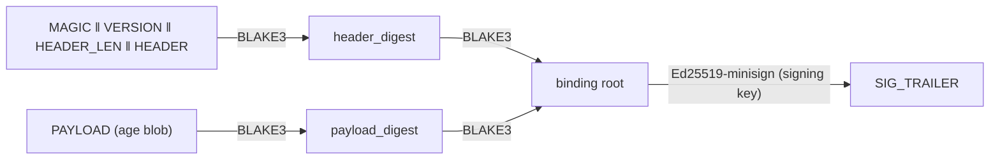
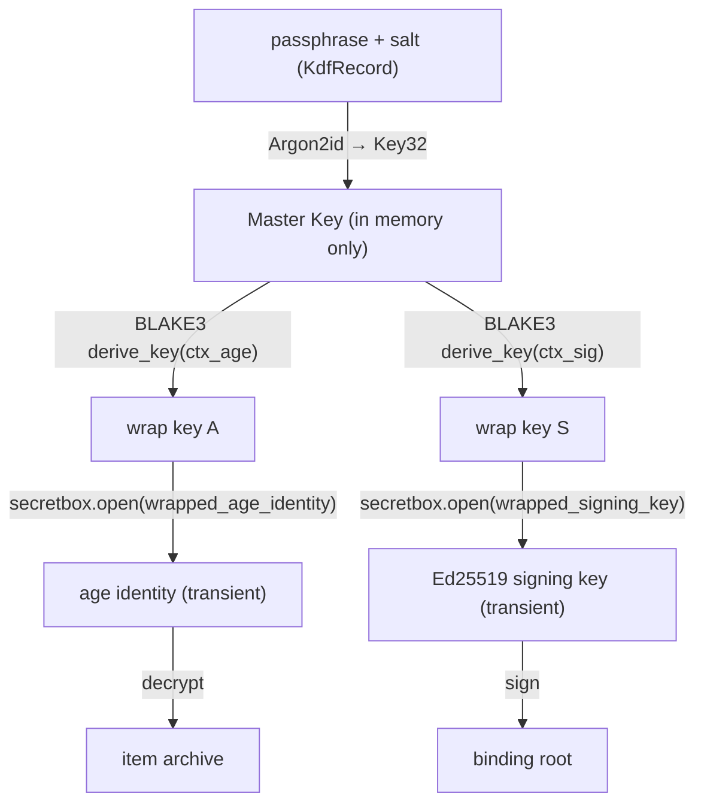
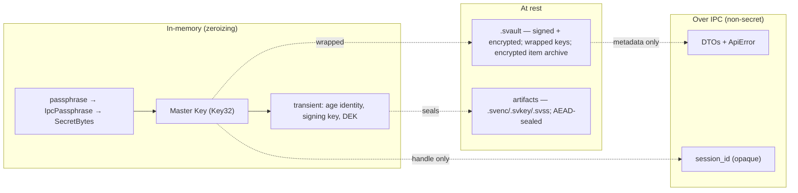

# 5. Data Design

All on-disk formats are **self-describing** (a 4–6 byte magic + a `u16` little-endian format
version) so a wrong file type or version fails cheaply and distinctly before any cryptographic work.
Each format below is quoted from the source that reads/writes it.

## 5.1 Format catalog

| Format | Magic | Producer | Purpose |
|--------|-------|----------|---------|
| `.svault` | `SVLT` (4) | `sv-core` | Encrypted vault container |
| `SVENC` | `b"SVENC\0"` (6) | `sv-platform` | Passphrase-encrypted file artifact |
| `SVKEY` | `b"SVKEY\0"` (6) | `sv-platform` | Signing secret key, encrypted at rest |
| `SVSSS` | `b"SVSSS\0"` (6) | `sv-platform` | One Shamir **piece** (92 bytes) |
| `SVSSP` | `b"SVSSP\0"` (6) | `sv-platform` | Shamir-split **payload** (DEK-encrypted) |
| `SVSTEG` | `"SVSTEG"` (6) | `sv-stego` | Steganography envelope (embedded, not a file) |

The watermark module writes a normal PNG/BMP image (no envelope); the mark lives in the LSB plane.

---

## 5.2 The `.svault` container

### 5.2.1 Framing

Source: [crates/sv-core/src/format.rs](../../crates/sv-core/src/format.rs),
[crates/sv-core/src/container.rs](../../crates/sv-core/src/container.rs).

```
┌─────────┬────────────────┬─────────────┬───────────────────┬──────────┬───────────────┐
│ MAGIC   │ FORMAT_VERSION │ HEADER_LEN  │ HEADER (CBOR)     │ PAYLOAD  │ SIG_TRAILER    │
│ "SVLT"  │ u16 LE (= 1)   │ u32 LE      │ HEADER_LEN bytes  │ age blob │ minisign fmt   │
│ 4 bytes │ 2 bytes        │ 4 bytes     │ ≤ 1 MiB           │ …        │ …              │
└─────────┴────────────────┴─────────────┴───────────────────┴──────────┴───────────────┘
```

- `MAGIC = *b"SVLT"` ([format.rs:31](../../crates/sv-core/src/format.rs#L31)); `FORMAT_VERSION: u16
  = 1` ([format.rs:35](../../crates/sv-core/src/format.rs#L35)).
- The header is **CBOR** (`ciborium`). `MAX_HEADER_LEN = 1 << 20` (1 MiB) is a parse-time DoS guard
  ([container.rs:41](../../crates/sv-core/src/container.rs#L41)).

### 5.2.2 `VaultHeader`

[format.rs:82](../../crates/sv-core/src/format.rs#L82):

| Field | Type | Secret? | Meaning |
|-------|------|---------|---------|
| `format_version` | `u16` | ❌ | Mirrors on-disk version |
| `suite` | `CipherSuite` (`V1`) | ❌ | Ciphersuite designator (H1) |
| `vault_uuid` | `[u8; 16]` | ❌ | Vault identity; binds wrap-key derivation (H2) |
| `created_unix` / `modified_unix` | `u64` | ❌ | Timestamps |
| `kdf` | `KdfRecord { salt: Salt, params: KdfParams }` | salt/params ❌ | Master-key derivation descriptor |
| `wrapped_age_identity` | `WrappedSecret { nonce, ciphertext }` | ciphertext = wrapped secret | age X25519 identity, `secretbox`-wrapped |
| `age_recipient` | `AgeRecipient` (`age1…`) | ❌ | Public recipient (needed to re-encrypt) |
| `wrapped_signing_key` | `WrappedSecret` | ciphertext = wrapped secret | Ed25519 signing key, `secretbox`-wrapped |
| `signing_public_key` | `[u8; 32]` | ❌ | Verify the container without unlocking |
| `share_policy` | `Option<SharePolicyRecord { shares_total, threshold }>` | ❌ | Recovery policy metadata |
| `content_layout` | `ContentLayout { payload_len: u64 }` | ❌ | Payload length |

The wrapped secrets are ciphertext only; the cleartext age identity and signing key **never** touch
disk. `CipherSuite::V1` is a **closed enum** — Argon2id · BLAKE3 · `secretbox` · age v1 ·
Ed25519-minisign — so invalid algorithm combinations are unrepresentable
([format.rs:41](../../crates/sv-core/src/format.rs#L41)).

### 5.2.3 Authentication (binding root)



`binding_root = BLAKE3(BLAKE3(header_prefix) ‖ BLAKE3(payload))`
([container.rs:231](../../crates/sv-core/src/container.rs#L231)). Both section digests are
**recomputed on read**, never stored — preventing header↔payload splicing (H5). The signature
covers the binding root. On read, if the caller pins an expected public key the in-header key must
match (provenance, H4); otherwise verification is integrity-only against the in-header key.

### 5.2.4 Payload (encrypted item archive)

The payload is a single `age` ciphertext over a packed archive
([container.rs:276](../../crates/sv-core/src/container.rs#L276)):

```
DIR_LEN (u32 LE) ‖ CBOR(ItemDirectory) ‖ item-bytes...
```

`ItemDirectory { items: Vec<ItemEntry> }`; each `ItemEntry`
([format.rs:147](../../crates/sv-core/src/format.rs#L147)):

| Field | Type | Meaning |
|-------|------|---------|
| `item_id` | `[u8; 16]` | Stable id |
| `name` | `String` | Display name |
| `plaintext_offset` / `plaintext_len` | `u64` | Slice within decrypted item-bytes |
| `plaintext_blake3` | `[u8; 32]` | Per-item content digest |
| `added_unix` | `u64` | Timestamp |

The whole archive is encrypted as **one** age blob (single-payload model), and the directory lives
**inside** that ciphertext — so item names and the item inventory are confidential at rest.

---

## 5.3 Key hierarchy and wrapping

Source: [crates/sv-core/src/keys.rs](../../crates/sv-core/src/keys.rs).



- Context grammar (frozen): `secure-vault/v<SUITE_VERSION>/wrap/<field>:<uuid_hex>`, with
  `SUITE_VERSION = 1` and `WrapField ∈ {age-identity, signing-key}`
  ([keys.rs:26](../../crates/sv-core/src/keys.rs#L26), [:44](../../crates/sv-core/src/keys.rs#L44)).
  Binding the vault UUID into every derived key means a wrapped secret cannot be transplanted between
  vaults.
- All keys are the zeroizing `Key32`; the master key is the only secret held for the session
  lifetime; wrap keys and unwrapped secrets are derived per operation and dropped.

---

## 5.4 `sv-platform` artifact formats

Source: [crates/sv-platform/src/artifact.rs](../../crates/sv-platform/src/artifact.rs),
[crates/sv-platform/src/sharing.rs](../../crates/sv-platform/src/sharing.rs).

### 5.4.1 `SVENC` / `SVKEY` (passphrase-sealed)

```
MAGIC(6) ‖ version u16 LE ‖ kdf_alg u8(=0 Argon2id) ‖ mem_kib u32 LE ‖ time_cost u32 LE
        ‖ parallelism u32 LE ‖ salt(16) ‖ aead_alg u8(=0 secretbox) ‖ nonce(24) ‖ ciphertext(+16B tag)
```

- 62-byte header before ciphertext. Argon2 parameters are stored in the header; **pre-auth ceilings**
  (`MAX_KDF_MEM_KIB = 4 GiB`, `MAX_KDF_TIME_COST = 64`, `MAX_KDF_PARALLELISM = 64`) reject a hostile
  header before any KDF work.
- The file key is `BLAKE3.derive_key("secure-vault/platform/v1/<MAGIC_TAG>", Argon2id(passphrase,
  salt, params))`, so domain separation prevents an `SVENC` key from opening an `SVKEY` artifact.
- `SVENC` = Encrypt File output; `SVKEY` = the at-rest signing secret key.

### 5.4.2 `SVSSS` piece (92 bytes) and `SVSSP` payload

```
SVSSS piece (92 bytes):
  magic "SVSSS\0"(6) ‖ version u16 LE ‖ group_id(16) ‖ total n(1) ‖ threshold k(1)
  ‖ share_index(1) ‖ payload_ref = BLAKE3(payload)(32) ‖ key_share(33; byte0 = Lagrange x)

SVSSP payload (variable):
  magic "SVSSP\0"(6) ‖ version u16 LE ‖ aead_alg u8(=0 secretbox) ‖ nonce(24) ‖ ciphertext(+16B tag)
```

The scheme is **hybrid**: a random 32-byte DEK is Shamir-split into the `key_share`s, and the payload
key is `BLAKE3.derive_key("secure-vault/platform/v1/SVSS|{group_id}|{n}|{k}", DEK)` — so any tamper
of `group_id`, `n`, or `k` changes the key and the AEAD open fails. `payload_ref` binds each piece to
exactly its payload. Pieces also travel as **Base64 strings** (RFC 4648, 92 B → 124 chars) for
copy-paste, and as **QR PNGs** (via `sv-qr`).

---

## 5.5 `SVSTEG` envelope (steganography)

Source: [crates/sv-stego/src/envelope.rs](../../crates/sv-stego/src/envelope.rs). 54 bytes, embedded
into carrier sites (not a standalone file):

```
magic "SVSTEG"(6) ‖ version(1) ‖ flags(1) ‖ kdf_alg(1=Argon2id) ‖ aead_alg(1=secretbox)
      ‖ salt(16) ‖ nonce(24) ‖ ct_len u32 BE(4)
```

`flags` bit0 selects the carrier (spatial vs JPEG) and bit1 the site selector (sequential vs
permuted). The 16-byte `salt` seeds **both** the Argon2id KDF and the permutation scheduler, so the
header alone reconstructs the read order.

---

## 5.6 IPC data-transfer objects (`sv-types`)

Source: [crates/sv-types/src/lib.rs](../../crates/sv-types/src/lib.rs). **Hard invariant: no secret
material appears in this crate** ([lib.rs:5](../../crates/sv-types/src/lib.rs#L5)). Salts, public
keys, hashes, counts, and KDF *parameters* are non-secret and may appear; passphrases, keys,
identities, and raw shares may not.

| DTO | Notable fields | Notes |
|-----|----------------|-------|
| `SessionHandle` | `session_id: String` | Opaque; **no key material** |
| `VaultMeta` | uuid, format_version, timestamps, item_count, share_policy, `kdf` | Non-secret description |
| `KdfDescriptor` | algorithm, mem_kib, time_cost, parallelism | Transparency only |
| `ItemInfo` | item_id, name, size_bytes, content_hash_hex, added_unix | Never plaintext/ciphertext |
| `AppInfo` | app_version, contract_version, max_format_version, suite_version | Version handshake (E1) |
| `IntegrityReport` | blake3_ok, signature_ok, computed_hash_hex | Vault integrity |
| `VerifyIntegrityReport` | hash_checked, hash_matched, signature_checked, signature_valid, computed_hash_hex, verified | Independent opt-in checks |
| `ShareExportInfo` / `ShareSplitReport` | paths, counts; `share_b64` (text workflow only) | `share_b64` is the **deliberate exception**: piece strings are secret-equivalent and threshold-reconstructive; file workflow leaves it empty |
| `SigningKeypairInfo` | public_key_path, secret_key_path, public_key_hex | Secret key written **encrypted**; only paths + public key in the DTO |
| `MetadataReport` / `SanitizeReport` / `MetadataDiffReport` | format, mime, tags, `guaranteed` | Analysis outputs |
| `StegoHideReport` / `StegoExtractReport` / `StegoDetectReport` | paths, capacity, `Suspicion`, signals | Detection never reports "clean" |
| `WatermarkEmbedReport` / `WatermarkVerifyReport` (`WatermarkVerdict`) | dims, block counts, verdict | No "Authentic" variant — tamper-evidence, not authorship |

The verdict/suspicion enums are deliberately missing any “clean/authentic/safe” value so the type
system prevents the product from over-claiming: `Suspicion ∈ {NotObserved, Low, Elevated, High}`,
`WatermarkVerdict ∈ {Intact, Tampered, NotWatermarked}`.

### 5.6.1 `ApiError` (the wire error type)

`#[serde(tag = "code")]` enum; the discriminant **is** the stable machine code. Twelve codes
([lib.rs:455](../../crates/sv-types/src/lib.rs#L455)):

`SV-NOT-FOUND`, `SV-MALFORMED`, `SV-INCOMPATIBLE-VERSION`, `SV-CORRUPTED`, `SV-UNAUTHORIZED`,
`SV-INSUFFICIENT-SHARES`, `SV-INVALID-INPUT`, `SV-IO`, `SV-TOO-LARGE`, `SV-TIMEOUT`,
`SV-OUTPUT-EXISTS`, `SV-INTERNAL`. `CONTRACT_VERSION = 1`. The full mapping and oracle-safety rules
are in [06-security-design.md](06-security-design.md) §6.4.

---

## 5.7 Data lifecycle (where each datum lives)



**Invariant:** the only secret that crosses the IPC boundary is the passphrase (entering as
`IpcPassphrase`); everything returned to the UI is a non-secret DTO or an opaque handle. The one
auditable exception is `ShareSplitReport.share_b64` for the text-secret workflow, where the piece
strings are themselves the distributable output (documented at the DTO and noted in §5.6).
