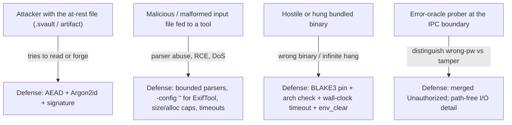
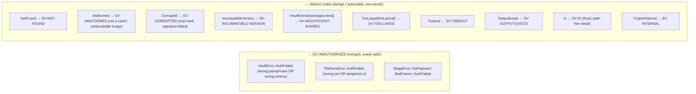
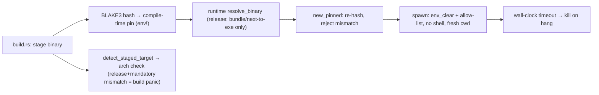

# 6. Security Design

This section consolidates the security architecture: the threat model, the trust boundaries and the
controls on each, the oracle-safe error model, secret hygiene, subprocess hardening, the
cryptographic constructions, and the documented assumptions/residual risks. It reflects the frozen
`docs/M7-HARDENING.md` threat model as implemented in code.

## 6.1 Security objectives

| Objective | Mechanism |
|-----------|-----------|
| **Confidentiality at rest** | age (X25519 + ChaCha20-Poly1305) payload; Argon2id-derived KEK; `secretbox`-wrapped keys; `SVENC` artifacts AEAD-sealed |
| **Integrity & tamper-evidence** | Ed25519-minisign signature over a BLAKE3 binding root; per-item BLAKE3; AEAD tags everywhere |
| **Confidentiality in memory** | Zeroizing secret types; secrets never serialized; transient unwrapping |
| **No secret egress** | No secret in any DTO; opaque session handles; coded `ApiError` |
| **Oracle resistance** | Credential failures merge to one code; benign conditions stay distinct |
| **Supply-chain integrity** | External binaries BLAKE3-pinned + arch-checked at build; resolution closed in release |
| **Least privilege at the subprocess** | `env_clear`, no shell, fixed working dir, wall-clock timeout, config-as-code disabled |
| **Availability / DoS resistance** | Size caps, decompression-bomb limits, pre-auth KDF ceilings, bounded header |

## 6.2 Threat model

### In scope (defended)

- **At-rest disclosure / tampering / forgery** — defended by authenticated encryption and a signed
  binding root.
- **Malicious vault or malicious media** — bounded, fuzz-tested parsers; `MAX_HEADER_LEN`; image
  decompression-bomb limits; pre-auth Argon2 ceilings; ExifTool config-as-code disabled.
- **Hostile/hung bundled binary** — BLAKE3 pin (byte-identity), build-time architecture check, and a
  120 s (age) / 60 s (ExifTool) wall-clock timeout.
- **Error-oracle probing** — credential failures collapse to `SV-UNAUTHORIZED`; I/O errors are
  path-free.

### Out of scope (documented residual risk)

- **Privileged local attacker reading process memory** (a debugger/root on the same machine can read
  live secrets; zeroization shrinks but cannot eliminate the window).
- **IPC passphrase copies upstream of our code** — the Tauri/serde message and JSON-parse buffers
  copy the passphrase string before `IpcPassphrase` can zeroize *our* copy (see §6.5).
- **Timing/side channels** beyond the explicit oracle-safe merges.
- **OS swap / hibernation** writing plaintext or keys to disk (mitigate with full-disk + swap
  encryption).
- **Distribution-tier protections (H5)** — code signing / notarization. Out of scope for internal
  use.

## 6.3 Trust boundaries and controls

| Boundary | Threat | Control | Evidence |
|----------|--------|---------|----------|
| **Webview ↔ core (IPC)** | Secret egress, oracle | No secret DTO; coded `ApiError`; `IpcPassphrase` zeroized | [crates/sv-types/src/lib.rs:5](../../crates/sv-types/src/lib.rs#L5), [src-tauri/src/passphrase.rs](../../src-tauri/src/passphrase.rs) |
| **Core ↔ age subprocess** | Wrong/hostile binary, hang, env leakage | BLAKE3 pin; `env_clear` + Win allow-list; 120 s timeout; secret identity in `0600` temp, zeroized | [crates/sv-age/src/lib.rs:62](../../crates/sv-age/src/lib.rs#L62), [:108](../../crates/sv-age/src/lib.rs#L108), [:147](../../crates/sv-age/src/lib.rs#L147) |
| **Core ↔ ExifTool subprocess** | RCE via config, hang, env leakage | `-config ""`; `env_clear`; no shell; fresh cwd; 60 s timeout; BLAKE3 pin; fail-closed | [crates/sv-meta/src/lib.rs](../../crates/sv-meta/src/lib.rs) |
| **Core ↔ filesystem** | Tamper, partial write, overwrite | Signed+encrypted container; atomic temp+rename; refuse-existing | [crates/sv-core/src/container.rs:333](../../crates/sv-core/src/container.rs#L333), [crates/sv-platform/src/lib.rs:146](../../crates/sv-platform/src/lib.rs#L146) |
| **Build ↔ runtime (binary resolution)** | Redirect to out-of-bundle toolchain | Release ignores `SV_*_BIN`; resolves only from bundle / next-to-exe | [desktop/src/lib.rs:513](../../desktop/src/lib.rs#L513) |
| **Audited core ↔ webview deps** | Unaudited transitive crates | `desktop/` excluded from workspace; `cargo deny`/`audit` gate the core (+ a separate desktop scan) | [Cargo.toml](../../Cargo.toml), [.github/workflows/ci.yml](../../.github/workflows/ci.yml) |

## 6.4 Oracle-safe error model

`ApiError` is `#[serde(tag = "code")]` with twelve stable codes
([crates/sv-types/src/lib.rs:455](../../crates/sv-types/src/lib.rs#L455)). The mapping from every
domain error converges so an attacker cannot distinguish credential failures, while benign,
actionable conditions stay distinct.

Load-bearing properties (each backed by a test, see [08](08-testing-and-validation.md)):

- **Wrong passphrase vs. wrong recovery shares** are merged into one code; the *count* pre-check
  (`InsufficientShares`) is separate and non-secret, so the UI can still say “you need N more pieces.”
- **“Not a vault” (`Malformed`)**, **“real but corrupted/tampered” (`Corrupted`)**, and
  **“unsupported version” (`IncompatibleVersion`)** are distinct — they are facts about the file, not
  secrets, and they are actionable.
- **Steganography extraction** merges “no payload here,” “structurally bad frame,” “wrong key,” and
  “tampered carrier” — an attacker cannot even learn whether an image carries an `sv-stego` payload.
- **I/O errors never leak the path or OS message** — `ApiError::io_generic()` returns one fixed,
  non-secret string used identically at the vault and platform boundaries
  ([crates/sv-types/src/lib.rs:508](../../crates/sv-types/src/lib.rs#L508)).
- **Unexpected backend/crypto errors** redact to `SV-INTERNAL`; meaningful crypto failures are
  translated to semantic codes at the call site (unwrap → `Unauthorized`, payload-decrypt fail →
  `Corrupted`, timeout → `Timeout`).

## 6.5 Secret hygiene

| Secret | Lifetime | Protection |
|--------|----------|-----------|
| Passphrase | Per call | `IpcPassphrase` zeroizes its copy on drop and on `into_secret`; redacted `Debug`; never logged or in a DTO ([src-tauri/src/passphrase.rs](../../src-tauri/src/passphrase.rs)) |
| Master key | Per session | `Key32` (`ZeroizeOnDrop`); held only in `SessionState`, dropped on `lock` |
| age identity / signing key | Per operation | Unwrapped transiently, used, dropped; identity written to `0600` temp file, overwritten + unlinked on drop |
| DEK (secret sharing) | Per split/recover | Split into `KeyShare`s, scratch zeroized; never stored |
| Derived/wrap keys | Per operation | `Key32`; scratch zeroized in adapters |

**Documented residual (N1):** the passphrase arrives as a JSON string across the Tauri bridge, so the
runtime has already made copies (raw IPC buffer, serde parse buffer) that the application cannot
reach to zeroize. `IpcPassphrase` zeroizes the copy it controls and converts to `SecretBytes` on the
first line of each handler; the upstream copies are an accepted residual, mitigated by OS-level
disk/swap encryption and by excluding these commands from argument logging.

## 6.6 Subprocess hardening (defense in depth)

- **Pinning** ([desktop/build.rs](../../desktop/build.rs) `emit_pin`): age/age-keygen are
  `Mandatory::Yes` — a *release* build with one missing **panics the build**; exiftool is
  `Mandatory::No` — its absence disables the Analysis module fail-closed.
- **Architecture check** (`detect_staged_target` + `check_staged_arch`): reads Mach-O/ELF/PE headers
  (no execution) and panics a release build that would bundle a wrong-arch *mandatory* binary the
  pin alone could not catch. Magic bytes used: ELF `7F 45 4C 46`, Mach-O64 `CF FA ED FE`, fat
  `CA FE BA BE/BF`, PE `MZ` → `PE\0\0`.
- **Resolution surface** (`resolve_binary`): `SV_AGE_BIN`/`SV_AGE_KEYGEN_BIN`/`SV_EXIFTOOL_BIN`
  overrides are honored **only** in debug builds; a release build resolves solely from the bundled
  resource dir or next to the executable (the pin would still reject a mismatch — this closes the
  resolution surface as hardening).
- **Runtime verification**: `AgeCipher::new_pinned` / `ExifTool::new_pinned` re-hash and reject a
  mismatch before any use.
- **Execution sandboxing**: `env_clear()` (only `SystemRoot`/`SystemDrive`/`TEMP`/`TMP` re-added on
  Windows for the loader/CSPRNG — the validated **H4** path), **no shell**, fresh working directory
  (ExifTool), and a wall-clock timeout that kills a hung child.

## 6.7 Cryptographic constructions (summary)

| Purpose | Construction | Where |
|---------|--------------|-------|
| Passphrase KDF | **Argon2id**, default 256 MiB / 3 / 1; OWASP floor enforced | `sv-crypto` `Argon2Kdf` + `policy` |
| Content hash / MAC / subkeys | **BLAKE3** (`hash`, `keyed_hash`, `derive_key`) | `sv-crypto` `Blake3Hasher` |
| Key wrapping & artifact AEAD | **`secretbox`** (XSalsa20-Poly1305) | `sv-crypto::secretbox`, libsodium |
| Vault payload encryption | **age v1** (X25519 + ChaCha20-Poly1305) | `sv-age` subprocess |
| Signatures | **Ed25519** in minisign format (BLAKE2b prehash) | `sv-crypto::minisign`, libsodium |
| Secret sharing | **Shamir** (`sss` hazmat) over a 32-byte DEK | `sv-sys-sss` |
| Domain separation | BLAKE3 `derive_key` with versioned context strings binding vault UUID / group id | `sv-core::keys`, `sv-platform` |

No bespoke primitive is implemented; the only first-party cryptographic *logic* is the minisign
on-disk encoding and the domain-separation context construction, both built on vetted primitives.

## 6.8 Availability / DoS controls

| Control | Value | Where |
|---------|-------|-------|
| Vault item / plaintext cap | 2 GiB (stat-then-cap-then-read) | [src-tauri/src/service.rs:53](../../src-tauri/src/service.rs#L53), [crates/sv-platform/src/lib.rs:41](../../crates/sv-platform/src/lib.rs#L41) |
| Vault header cap | 1 MiB | [crates/sv-core/src/container.rs:41](../../crates/sv-core/src/container.rs#L41) |
| Pre-auth Argon2 ceilings | 4 GiB / t≤64 / p≤64 | [crates/sv-platform/src/artifact.rs](../../crates/sv-platform/src/artifact.rs) |
| Image decompression bomb | dim ≤ 30 000 (20 000 for QR), alloc ≤ 1 GiB (512 MiB for QR) | sv-stego / sv-watermark / sv-qr |
| Image / metadata file caps | 64 MiB (stego/qr), 256 MiB (watermark), 8 GiB (metadata) | per-module |
| Subprocess wall-clock | 120 s (age), 60 s (ExifTool) | sv-age / sv-meta |
| Per-vault write serialization (H7) | canonicalized-path mutex | [src-tauri/src/service.rs:104](../../src-tauri/src/service.rs#L104) |

## 6.9 Known limitations (tracked, not closed)

- **H5 — signing/notarization:** the bundle is unsigned; out of scope for internal use.
- **H1 — streaming:** encryption buffers in memory (bounded at 2 GiB) rather than streaming; vault
  hashing is also un-streamed.
- **Multi-process vault lock:** only intra-process serialization exists.
- **TOCTOU on re-exec without re-hash; unbounded write-lock map; minor non-atomic writes in
  sv-watermark/sv-qr (mitigated by refuse-existing first); `dct-io` 0.1.1 unaudited JPEG parser;
  webview dependency tree not under `cargo deny` licenses gate** — Low-severity backlog from the
  release-readiness audit.
