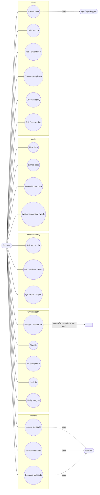
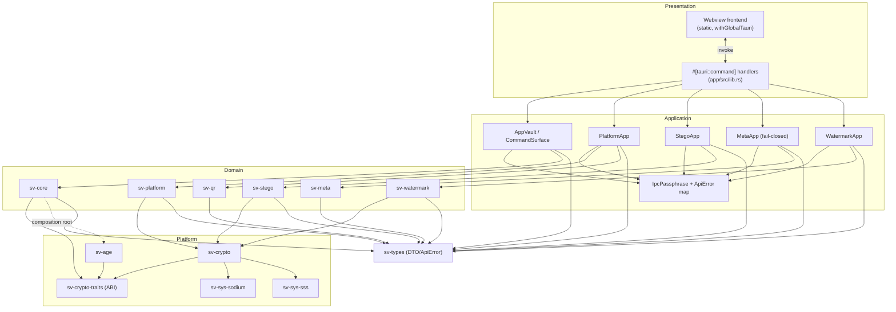
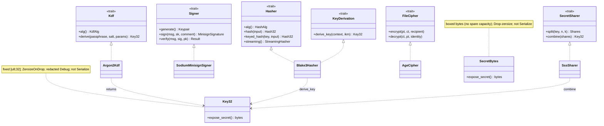
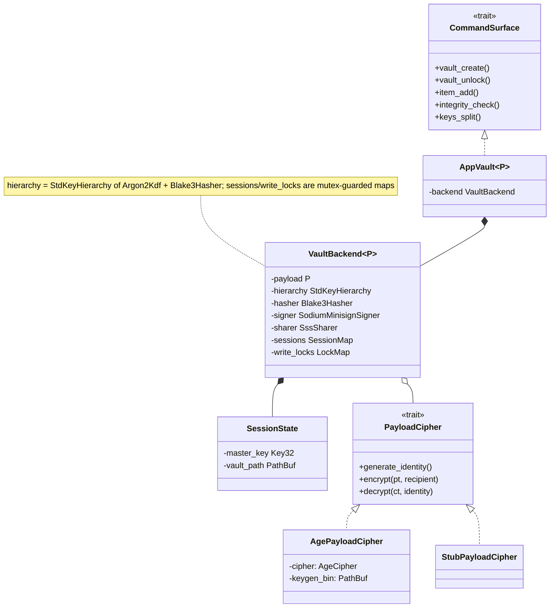
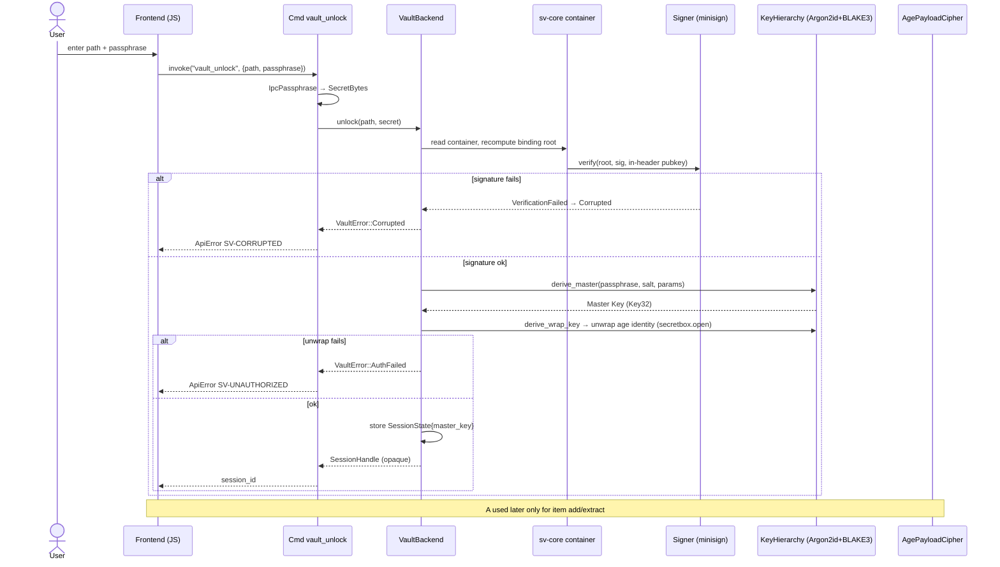
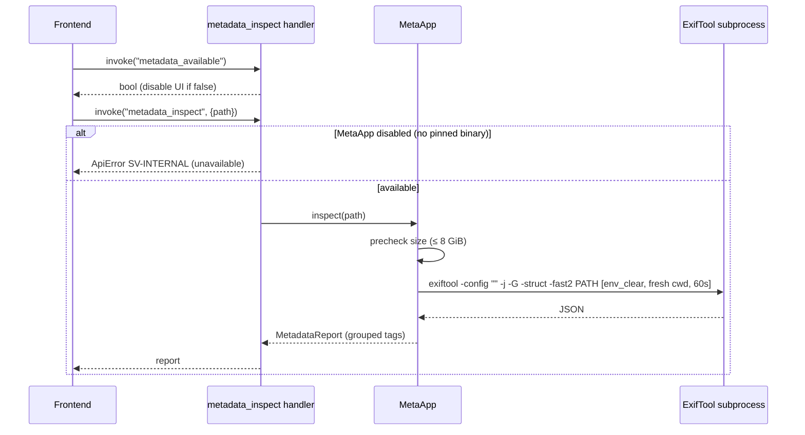
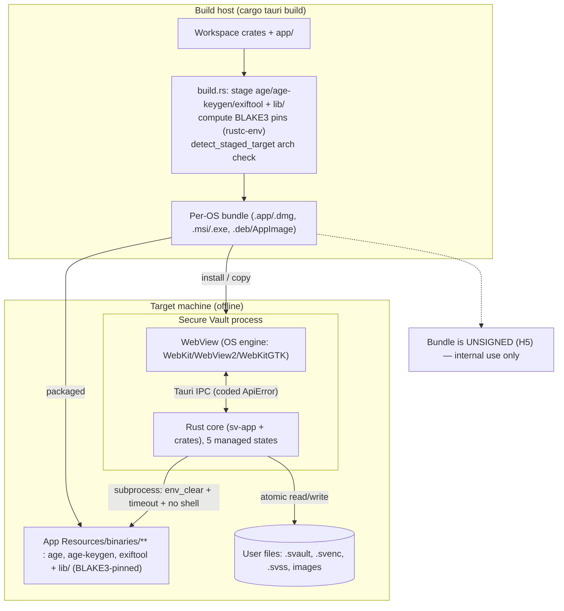
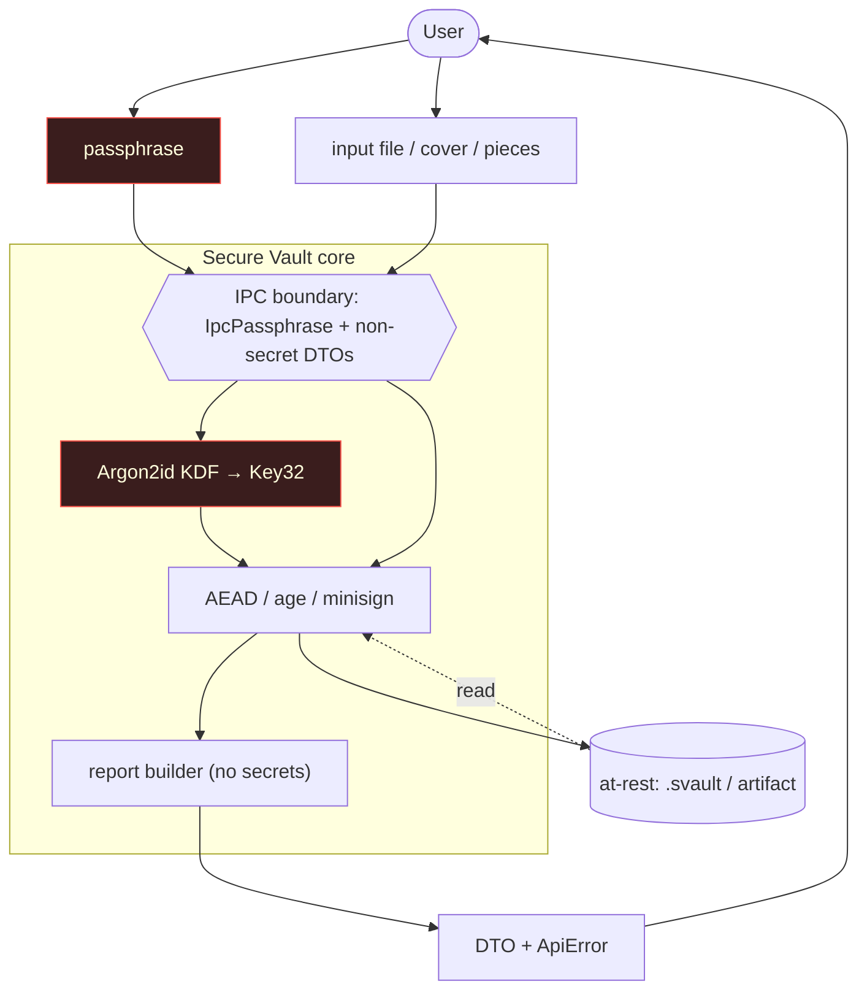

# 7. UML & Architecture Diagrams

All diagrams are Mermaid and reflect the implemented code. They complement the textual sections;
where a diagram simplifies, the authoritative detail is the cited source.

---

## 7.1 Use-case diagram



> Note: the **vault** payload uses the `age` binary; the **Cryptography** module's Encrypt/Decrypt
> File uses pure-Rust Argon2id + `secretbox` (the `SVENC` artifact) and does **not** invoke `age`.

---

## 7.2 Component diagram



---

## 7.3 Class diagram — crypto ABI and adapters



---

## 7.4 Class diagram — vault composition root



---

## 7.5 Sequence — vault unlock



The wrong-passphrase path (`AuthFailed → SV-UNAUTHORIZED`) and the tamper path (`Corrupted →
SV-CORRUPTED`) are intentionally distinct because tamper is detected *before* the credential check
(signature gate first); wrong passphrase vs. wrong recovery share remain merged.

---

## 7.6 Sequence — add item (encrypt-and-store)

```mermaid
sequenceDiagram
    participant H as item_add handler
    participant B as VaultBackend
    participant L as write_lock (per-vault mutex)
    participant C as container/archive
    participant A as age subprocess
    participant S as Signer
    participant FS as Filesystem

    H->>B: add_item(session, source, name)
    B->>B: stat source; reject if > 2 GiB (TooLarge)
    B->>L: acquire per-vault write lock (H7)
    B->>C: read+decrypt current payload, unpack archive
    B->>C: append item, repack (DIR_LEN ‖ CBOR ‖ bytes), per-item BLAKE3
    B->>A: encrypt(archive, recipient)  [env_clear, timeout]
    A-->>B: age ciphertext
    B->>S: sign(binding_root)
    S-->>B: minisign trailer
    B->>FS: write_atomic(temp → fsync → rename)
    B->>L: release lock
    B-->>H: ItemInfo
```

---

## 7.7 Sequence — encrypt a file (Cryptography module, no age)

```mermaid
sequenceDiagram
    participant FE as Frontend
    participant H as crypto_encrypt_file handler
    participant P as PlatformCrypto
    participant K as Argon2Kdf + BLAKE3 derive_key
    participant X as secretbox (XSalsa20-Poly1305)
    participant FS as Filesystem

    FE->>H: invoke("crypto_encrypt_file", {input, output, passphrase})
    H->>H: IpcPassphrase → SecretBytes
    H->>P: encrypt_file(input, output, secret)
    P->>P: refuse_existing(output); read_capped(input, 2 GiB)
    P->>K: derive file key (random salt, recommended params, domain ctx)
    P->>X: seal(plaintext)
    X-->>P: nonce + ciphertext+tag
    P->>FS: write_atomic SVENC artifact
    P-->>H: output path
    H-->>FE: path (DTO)
```

---

## 7.8 Sequence — secret sharing split + recover

```mermaid
sequenceDiagram
    participant H as shares_split_* / recover handler
    participant P as sharing engine
    participant SSS as Shamir (sss)
    participant X as secretbox

    Note over H,X: SPLIT
    H->>P: split_secret/file(secret, n, k, dir)
    P->>P: random DEK (32B), random group_id (16B)
    P->>SSS: create_keyshares(DEK, n, k)
    P->>X: payload key = BLAKE3.derive_key(ctx|group|n|k, DEK); seal(secret)
    P-->>H: SVSSP payload + n SVSSS pieces (+ Base64 / QR)

    Note over H,X: RECOVER
    H->>P: recover_secret(pieces, payload, out)
    P->>P: gates: agreement, dup-x, non-zero-x, count≥k, payload_ref
    P->>SSS: combine_keyshares(shares) → DEK
    P->>X: re-derive payload key; open()
    alt open fails (wrong/tampered)
        P-->>H: AuthFailed → SV-UNAUTHORIZED
    else ok
        P-->>H: RecoverOutput (path, bytes, original name)
    end
```

---

## 7.9 Sequence — metadata inspect (fail-closed subprocess)



---

## 7.10 Deployment diagram



- The webview engine is **OS-provided** (WebKit on macOS, WebView2 on Windows, WebKitGTK on Linux) —
  it is not bundled; only the static frontend assets and the Rust binary + pinned tool binaries are.
- The five managed states (`Backend`, `Platform`, `Stego`, `Meta`, `Watermark`) are constructed in
  the Tauri `setup` hook ([app/src/lib.rs](../../app/src/lib.rs) `run()`).

---

## 7.11 Data-flow diagram (DFD)



**Trust-boundary crossings in the DFD**

1. **`user → ipc`**: the passphrase is the only secret to cross inward; it becomes `IpcPassphrase`
   then `SecretBytes` (documented upstream-copy residual).
2. **`seal ↔ store`**: data at rest is authenticated-encrypted; reads recompute and verify before
   trusting.
3. **`verdict → out → user`**: only non-secret DTOs and coded errors flow back; verdict/suspicion
   enums cannot express “clean/authentic.”
4. **(not shown) `seal → external binary`**: age/ExifTool subprocess crossing, hardened per §6.6.
