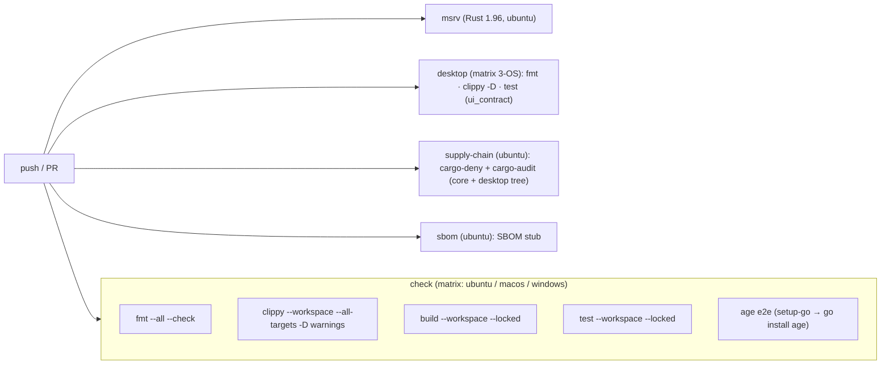

# 8. Testing & Validation

## 8.1 Approach

Validation rests on four pillars:

1. **Unit + integration tests** colocated with each crate (Rust `#[cfg(test)]` modules).
2. **CI gates** — fmt, clippy `-D warnings`, locked build, tests, supply-chain — on a **three-OS
   matrix** (Linux, macOS, Windows).
3. **A frontend↔backend contract test** that pins the UI's error-code map to `ApiError`'s codes.
4. **Documented validation campaigns** (`docs/VALIDATION-PLAN.md`, `VALIDATION-RESULTS.md`,
   `RELEASE-READINESS*.md`) that exercise the real backend + real `age` subprocess.

## 8.2 Test inventory (measured)

A direct scan of the current tree (`#[test]` / `#[tokio::test]` annotations) gives:

| Crate | Tests | Emphasis |
|-------|------:|----------|
| `sv-stego` | 74 | Carriers, capacity, envelope round-trips, detectors, oracle-safe extract, decode-bounded |
| `sv-platform` | 46 | Artifact seal/open, sharing engine gates, integrity composition, size caps, error mapping |
| `src-tauri` (`sv-app`) | 39 | Command surface, oracle-safety, size guards (H1), overwrite (H3), write-lock (H7) |
| `sv-core` | 22 | CBOR header round-trip, key hierarchy, container framing/binding, error oracle-safety |
| `sv-crypto` | 20 | Adapter behavior (BLAKE3/Argon2id/minisign/Shamir), policy floor |
| `sv-watermark` | 11 | Embed/verify, single-pixel tamper localization, wrong-key, JPEG refusal (H2/H3) |
| `sv-meta` | 10 | Pinning, JSON parse, diff, sanitize honesty, error mapping |
| `sv-qr` | 8 | Encode/decode round-trips, multi-QR, fail-closed on no-QR |
| `sv-age` | 6 | Hash-pin match/mismatch, timeout kill, identity temp cleanup, age e2e (env-gated) |
| `sv-crypto-traits` | 6 | Value-type redaction/non-serialization, alg-id round-trips |
| `sv-types` | 4 | DTO round-trips, `ApiError` code coverage |
| `sv-sys-sss` | 4 | Shamir FFI round-trip |
| `sv-sys-sodium` | 3 | libsodium FFI bindings |
| **Workspace total** | **253** | 249 pass + 4 `#[ignore]` env-gated e2e (verified `cargo test --workspace`, 2026-06-17) |
| `desktop` | 1 | **`ui_contract`** — `MESSAGES` map ↔ `ApiError::ALL_CODES` parity |

> **Currency note (measured 2026-06-17).** A local `cargo test --workspace` reports **249 passed,
> 0 failed, 4 ignored** — i.e. **253 test functions**, of which 4 are `#[ignore]` env-gated `age`/
> ExifTool e2e (2 in `sv-app`, 2 in `sv-meta`) that run in CI where `SV_AGE_BIN`/`SV_AGE_KEYGEN_BIN`
> are set. The desktop `ui_contract` test runs separately (the crate is workspace-excluded). This is
> **higher** than the **127** recorded in [docs/CI-VALIDATION.md](../CI-VALIDATION.md) for commit
> `780444d` (2026-06-15): the suite grew (stego 74, platform 46, command-surface 39 dominate the
> delta). The release/validation docs were reconciled to these figures on 2026-06-17; treat 127 as
> the last *recorded* green-CI number for that commit. See [09-discrepancies.md](09-discrepancies.md) §D-2.

## 8.3 Notable test categories

| Category | Examples (crate) | What it proves |
|----------|------------------|----------------|
| **Oracle-safety** | `auth_failures_stay_merged_but_benign_conditions_are_distinct` (sv-core/error.rs); all-extract-failures-share-one-code (sv-stego) | Credential failures merge to `SV-UNAUTHORIZED`; benign conditions stay distinct |
| **Secret hygiene** | redacted-`Debug` / non-`Serialize` checks (sv-crypto-traits); `identity_temp_file_is_removed_on_drop` (sv-age) | Secrets don't leak via `Debug`, serialization, or temp files |
| **Authenticated container** | CBOR header round-trip + binding-root + framing (sv-core) | Header/payload splice and tamper are detected |
| **Subprocess hardening** | `hash_pin_matches_and_mismatches`, `run_aborts_a_hanging_binary_at_the_timeout` (sv-age) | Pin enforced; hung child is killed at the deadline |
| **age e2e** | `age_backed_lifecycle_roundtrips` (env-gated `SV_AGE_BIN`/`SV_AGE_KEYGEN_BIN`) | Real encrypt/decrypt through the bundled binary; validated `env_clear` on Windows (**H4**) |
| **DoS / bounds** | decode-bounded guards (sv-stego/qr/watermark); pre-auth Argon2 ceilings (sv-platform); oversized-source rejection (sv-app, H1) | Decompression bombs and oversized inputs are refused before allocation |
| **Data safety** | overwrite-refusal (H3), per-vault write-lock (H7) (sv-app) | No silent overwrite; concurrent writers don't lose updates |
| **Watermark semantics** | single-pixel-edit localization; global-alteration → Tampered not NotWatermarked (H2); JPEG refused (H3) (sv-watermark) | Fragility + correct verdict ladder |
| **UI contract** | `ui_contract` (desktop) | Frontend message map exactly covers `ApiError` codes — no orphan codes or stale keys |

## 8.4 CI gates

Source: [.github/workflows/ci.yml](../../.github/workflows/ci.yml). Five jobs:



Per [docs/CI-VALIDATION.md](../CI-VALIDATION.md) (commit `780444d`, 2026-06-15), **all jobs were
green** across the matrix (counting matrix expansion: `check`×3 + `desktop`×3 + `msrv` + `deny` +
`sbom` = 9 job runs). Notable points from that run:

- **Windows-first validation of H4** — `age_backed_lifecycle_roundtrips` passed on `windows-latest`,
  empirically confirming that `Command::env_clear()` with the `SystemRoot`/`SystemDrive`/`TEMP`/`TMP`
  allow-list does not break the age CSPRNG / DLL loader.
- The Linux/Windows test-count delta (127 vs 126 in that run) was a single `#[cfg(unix)]`-only test
  in `sv-age` — expected, not a failure.
- Five first-run failures were fixed (committed `desktop/Cargo.lock`, forced MSRV toolchain,
  `randombytes` symbol-clash rename, MSVC VLA fix in `hazmat.c`, `setup-go` for `age` on macOS) — all
  portability fixes, **no algorithm change** (`sv-sys-sss` behavior-preserving).

**MSRV:** Rust **1.96** (`Cargo.toml` `rust-version`), enforced by the dedicated `msrv` job.

## 8.5 Local gate commands

From `CLAUDE.md` (product gates), runnable from the workspace root:

```
cargo fmt --all --check
cargo clippy --workspace --all-targets -- -D warnings
cargo build --workspace --locked
cargo test --workspace
cargo deny check
```

The desktop crate is gated separately (it is workspace-excluded): `cargo fmt`/`clippy -D
warnings`/`test` run from `desktop/`. The `age` e2e tests require `SV_AGE_BIN` + `SV_AGE_KEYGEN_BIN`.

## 8.6 Validation campaigns (documented)

| Doc | Role |
|-----|------|
| [docs/VALIDATION-PLAN.md](../VALIDATION-PLAN.md) | Ranked hardening-risk hypotheses (H1–H7), each with a procedure to provoke the failure |
| [docs/VALIDATION-RESULTS.md](../VALIDATION-RESULTS.md) | Results against the real `VaultBackend` + `age`/`age-keygen` (e.g. H1 memory-peak ≈ 2.7× item size; H2 no-passphrase-confirmation; H3 silent-overwrite — the latter two since addressed) |
| [docs/RELEASE-READINESS.md](../RELEASE-READINESS.md) | Release-gate snapshot: H4 resolved (CI), H5 the remaining distribution blocker |
| [docs/RELEASE-READINESS-TOOLKIT.md](../RELEASE-READINESS-TOOLKIT.md) | 4-agent security/UX/maintainability review; no Critical; all Medium since fixed |

> **Hardening-risk H-series vs schema H-series.** The letter “H” names two different things in the
> docs: the **hardening-risk** series (H1 streaming, H4 Windows `env_clear`, H5 signing — in
> VALIDATION-PLAN / RELEASE-READINESS) and the **header-schema** series (H1–H6 in
> M5-SCHEMA-DECISIONS.md). They are unrelated; this package uses “H<n>” for the hardening-risk series
> unless prefixed “header-schema.”

## 8.7 Coverage gaps / caveats

- **Desktop runtime UI** is covered only by the `ui_contract` parity test — there is no automated
  browser/runtime UI test (the validation campaigns exercise the Rust backend directly).
- **`age` e2e** is environment-gated; a checkout without the binaries runs the non-e2e suite (the
  gated tests early-return rather than fail), which partly explains the recorded-vs-measured count
  gap in §8.2.
- **Webview dependency tree** is outside the workspace's `cargo deny` *licenses* gate (a separate
  desktop advisory/bans/sources scan exists); see [06-security-design.md](06-security-design.md)
  §6.9.
