# Final Report Diagrams — Required Set

> Source-grounded architecture diagrams for the Security & Privacy Toolkit (Secure Vault).
> Every diagram reflects the **current implementation** (verified against source, not docs).
> Diagrams are authored in [Mermaid](https://mermaid.js.org/) so they render on GitHub and in
> most report tooling; export to SVG/PNG for print.
>
> Companion to the audit in this package (`01`–`09`). The Required set is **15 figures**
> (DIAG-01/02/03/04/05/07/09/10/11/12/13/14/15/17/21). Supporting figures
> (06/08/16/18/19/20/22/23) are listed in the audit's diagram plan but not drawn here.
>
> **Status discipline:** all capabilities shown are *implemented* unless explicitly annotated
> "deferred". Two facts the figures make deliberately explicit, because the prose vision blurs them:
> 1. Vault payload encryption uses **age**; standalone file encryption (D2) uses **Argon2id + secretbox** — different pipelines.
> 2. The vault is **not yet a consumer** of `sv-platform`; it reaches the crypto primitives directly.

---

## DIAG-01 — System Context

*Type: C4 Level 1 (context). Section: 3 System Architecture.*
Establishes the offline, single-host trust boundary: there is **no network egress**; only file paths
and passphrases enter the app, and all external tools are bundled and hash-pinned.

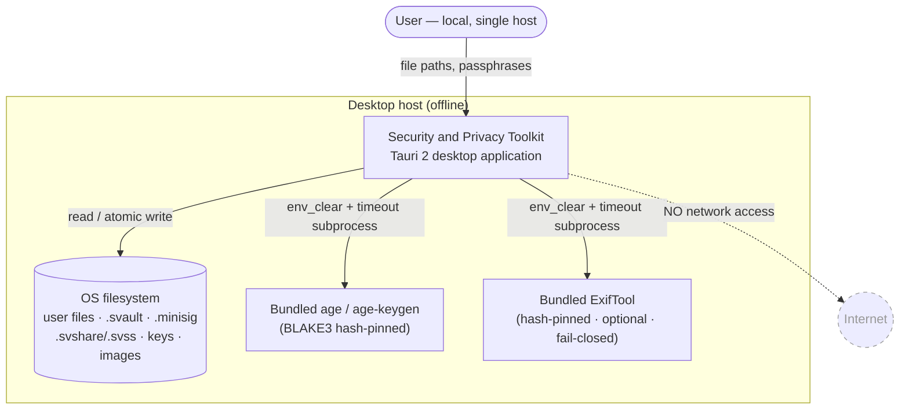

---

## DIAG-02 — Layered / Container Architecture

*Type: C4 Level 2 (container/layered). Section: 3 System Architecture.*
The four tiers plus the dependency-injection seam. The composition root owns **5 managed states**
and exposes **38 IPC commands**; secrets never cross the IPC boundary.

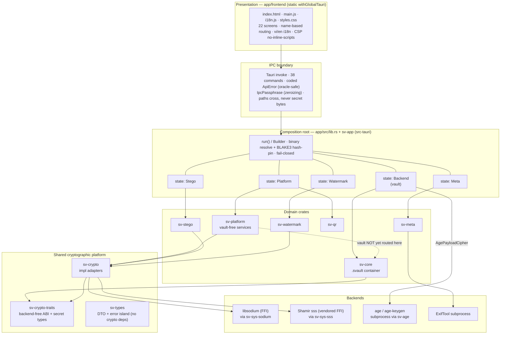

---

## DIAG-03 — Crate Dependency Graph

*Type: UML package / dependency. Section: 4 Module Design.*
Proves the dependency-injection design: `sv-crypto-traits` is the ABI root, `sv-types` is an
island with **no internal/crypto deps** (so a DTO structurally cannot hold a secret), and `sv-core`
takes `sv-crypto` only as a **dev-dependency** (production vault is FFI-free). Edges are exact,
taken from the Cargo manifests.

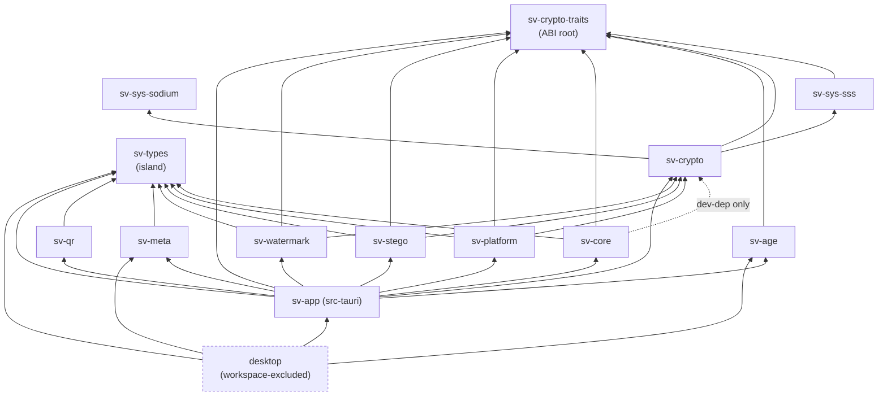

---

## DIAG-04 — Security-Domain Decomposition

*Type: component / capability map. Section: 4 Module Design.*
Regroups the UI's task menus into the **nine security domains** (the real architecture), each over
the shared platform D0. Shows which crates and IPC commands realize each domain.

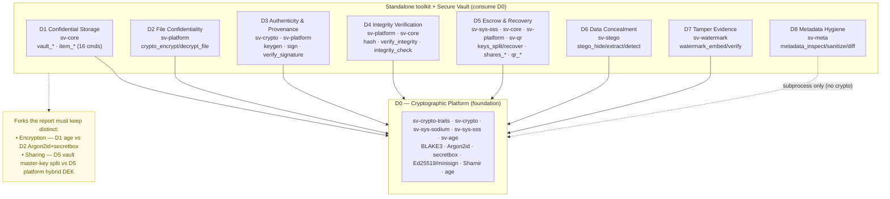

---

## DIAG-05 — Cryptographic Primitive Stack (trait → impl → backend)

*Type: UML class / layered mapping. Section: 4 Module Design.*
Every primitive and whether it is pure-Rust, FFI, or subprocess. Note secretbox is exposed as
free functions (not a trait), and there is no AEAD *trait* — `FileCipher` (age) is the only AEAD
trait abstraction.

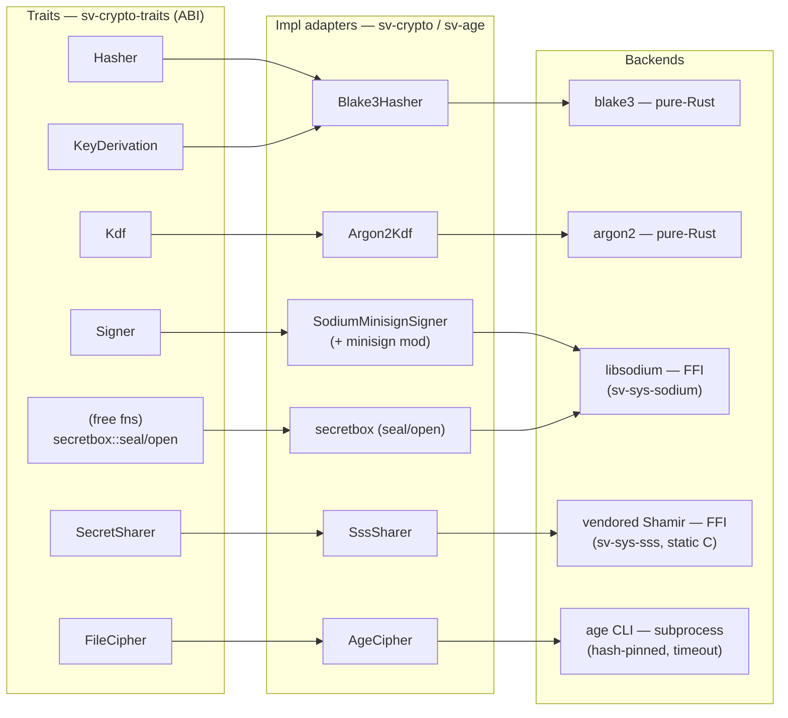

| Primitive | Algorithm | Backend |
|---|---|---|
| Content/keyed/streaming hash, subkey derivation | BLAKE3-256, `derive_key` | pure-Rust |
| Password KDF | Argon2id v1.3 (default 256 MiB / t=3 / p=1; OWASP floor enforced in `policy`) | pure-Rust |
| Secret-key wrap (AEAD) | XSalsa20-Poly1305 secretbox, random nonce, **no AAD (H2 pending)** | FFI (libsodium) |
| Digital signature | Ed25519, minisign "ED" prehashed (BLAKE2b-512 prehash) | FFI (libsodium) |
| Secret sharing | Shamir over GF(2⁸), 33-byte shares, k-of-n | FFI (vendored static C) |
| File encryption (vault payload) | age v1 (X25519 + ChaCha20-Poly1305) | subprocess (pinned) |

---

## DIAG-07 — `.svault` Container Byte-Layout

*Type: data-format / structure. Section: 5 Data Design.*
On-disk format and the binding-root signature. Section digests are recomputed on read, never stored;
only the minisign signature lives in the trailer, binding header ⇄ payload so they cannot be spliced.

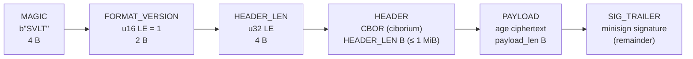

```text
header_digest  = BLAKE3( MAGIC ‖ VERSION ‖ HEADER_LEN ‖ HEADER )
payload_digest = BLAKE3( PAYLOAD )
binding_root   = BLAKE3( header_digest ‖ payload_digest )
SIG_TRAILER    = minisign-sign( binding_root )      trusted_comment = "secure-vault v1 container"

CBOR HEADER (deny_unknown_fields):
  format_version:u16 · suite:CipherSuite::V1 · vault_uuid:[16] · created_unix · modified_unix
  kdf: { salt:[16], params: KdfParams::Argon2id{mem_kib,time_cost,parallelism} }
  wrapped_age_identity: WrappedSecret{nonce, ciphertext}   age_recipient: "age1…" (public)
  wrapped_signing_key:  WrappedSecret{nonce, ciphertext}   signing_public_key:[32] (public)
  share_policy: Option<{shares_total, threshold}>          content_layout:{payload_len:u64}
  -- the encrypted PAYLOAD contains an ItemDirectory{ Vec<ItemEntry> }; no item dir or key in header
```

---

## DIAG-09 — Vault Key Hierarchy

*Type: key-derivation tree / block. Section: 5 Data Design.*
The wrapping design and the escrow point. The master key never touches disk; only `WrappedSecret`s
and `signing_public_key`/`age_recipient` are stored. Shamir splits the **master key itself**.

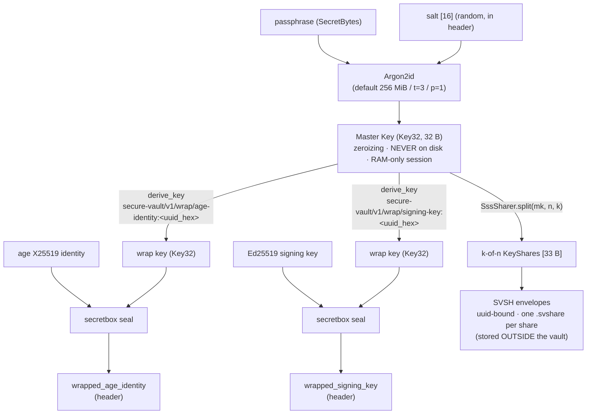

---

## DIAG-10 — Vault Create / Seal

*Type: UML sequence. Section: 6 Processing Pipelines.*

```mermaid
sequenceDiagram
    autonumber
    participant UI as Frontend
    participant VB as VaultBackend (sv-core)
    participant KH as KeyHierarchy (Argon2id+BLAKE3)
    participant PC as AgePayloadCipher
    participant SG as Signer (minisign)
    participant FS as Filesystem

    UI->>VB: vault_create(path, passphrase, policy?)
    VB->>VB: validate policy · acquire write-lock
    VB->>VB: random uuid[16] · salt[16] · KdfParams::default
    VB->>KH: derive_master(passphrase, salt, params)
    KH-->>VB: Master Key (Key32)
    VB->>PC: generate_identity() (age-keygen subprocess)
    PC-->>VB: (age identity, age recipient)
    VB->>SG: generate() Ed25519 keypair
    SG-->>VB: (signing sk, signing pk)
    VB->>VB: wrap age identity + signing key (secretbox under derived wrap keys)
    VB->>VB: build VaultHeader (recipient + pk public; wrapped secrets)
    VB->>VB: pack ItemDirectory([]) (plaintext concat, no compression)
    VB->>PC: encrypt(archive, recipient) → age ciphertext
    VB->>VB: header_digest, payload_digest, binding_root (BLAKE3)
    VB->>SG: sign(binding_root) → minisign trailer
    VB->>FS: write_atomic(SVLT bytes) (temp → fsync → rename)
    VB-->>UI: VaultMeta (non-secret) — no session created
```

---

## DIAG-11 — Vault Unlock / Unseal (oracle-safe ordering)

*Type: UML sequence. Section: 6 Processing Pipelines.*
The critical security property: the **signature is verified before any credential is tested**, so
tamper surfaces as `Corrupted` independent of the passphrase. Wrong passphrase and wrong recovery
share both collapse to a single `Unauthorized`.

```mermaid
sequenceDiagram
    autonumber
    participant UI as Frontend
    participant VB as VaultBackend
    participant CT as container::decode
    participant KH as KeyHierarchy
    participant FS as Filesystem

    UI->>VB: vault_unlock(path, passphrase)
    VB->>FS: read (size-capped ≤ 2 GiB from metadata)
    VB->>CT: decode(bytes) — parse framing, suite/version check
    CT->>CT: recompute digests · verify binding-root minisign signature
    alt signature invalid / structural tamper
        CT-->>UI: ApiError::Corrupted  (NOT an auth oracle)
    else signature valid
        VB->>VB: validate_kdf (reject hostile Argon2 cost ceilings)
        VB->>KH: derive_master(passphrase, header.salt, header.params)
        KH-->>VB: candidate Master Key
        VB->>VB: unwrap_secret(AgeIdentity)  ← credential gate
        alt unwrap MAC fails
            VB-->>UI: ApiError::Unauthorized (wrong passphrase)
        else unwrap ok
            VB->>VB: new_session(mk, path) — random 32 B id, RAM-only
            VB-->>UI: SessionHandle (opaque; no key crosses IPC)
        end
    end
```

---

## DIAG-12 — Standalone File Encrypt / Decrypt (D2 — Argon2id + secretbox)

*Type: UML activity / data-flow. Section: 6 Processing Pipelines.*
Made explicit because this is **not age**: `sv-platform` seals files with Argon2id + secretbox in an
`SVENC` artifact. Decrypt enforces pre-auth Argon2 DoS ceilings before running the KDF.

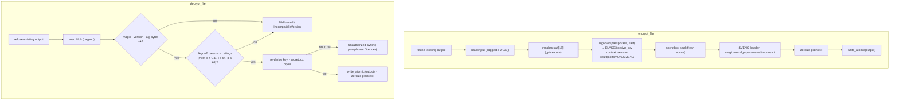

---

## DIAG-13 — Digital Signature: keygen → sign → verify (D3)

*Type: UML sequence. Section: 6 Processing Pipelines.*
Ed25519 in minisign format; the signing **secret key is encrypted at rest** with the same
Argon2id+secretbox mechanism (`SVKEY`). A failed verify returns `Ok(valid:false)`, not an error.

```mermaid
sequenceDiagram
    autonumber
    participant UI as Frontend
    participant P as PlatformCrypto (sv-platform)
    participant S as Signer (minisign / libsodium)
    participant FS as Filesystem

    rect rgb(245,248,255)
    note over UI,FS: generate_signing_keypair
    UI->>P: crypto_generate_signing_keypair(out_dir, name, passphrase)
    P->>S: generate() → (sk, pk)
    P->>FS: write name.pub  (pk as 64-hex text, public)
    P->>P: seal_with_passphrase(SVKEY, sk)  (Argon2id+secretbox)
    P->>FS: write name.svkey (encrypted sk; orphan .pub removed on failure)
    P-->>UI: PlatformKeypair (paths + pk hex; no secret bytes)
    end

    rect rgb(245,255,248)
    note over UI,FS: sign_file
    UI->>P: crypto_sign_file(input, signing_key_path, passphrase)
    P->>P: open SVKEY (wrong pass → Unauthorized) → sk
    P->>S: sign(data, sk, comment) — BLAKE2b-512 prehash + dual minisign sig
    P->>FS: write input.minisig
    P-->>UI: signature path
    end

    rect rgb(255,250,245)
    note over UI,FS: verify_signature
    UI->>P: integrity_verify_signature(file, sig, pubkey)
    P->>P: parse pubkey hex · BLAKE3(file)
    P->>S: verify(prehash sig, then global sig)
    P-->>UI: SignatureCheck{ valid: bool, file_blake3_hex }  (invalid = Ok(false))
    end
```

---

## DIAG-14 — Integrity Verification Decision Flow (D4)

*Type: UML activity. Section: 6 Processing Pipelines.*
`verify_integrity` composes hash + signature. Single file read shared between both checks (no skew);
the computed hash is always returned even when the verdict is false.

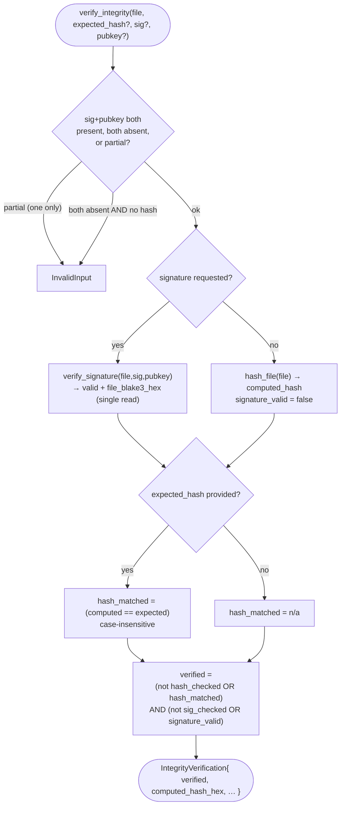

---

## DIAG-15 — Steganography Embed / Extract Data-Flow (D6)

*Type: data-flow (DFD). Section: 6 Processing Pipelines.*
Encrypt-then-embed: confidentiality/integrity is in the `SVSTEG` seal (Argon2id+secretbox); the
carrier (PNG/BMP spatial LSB, or JPEG DCT via `dct-io`) makes no secrecy claim. The capacity guard
runs **before** the expensive Argon2id work.

```mermaid
flowchart TB
    subgraph HIDE["stego_hide"]
        h1["cover image"] --> h2["decode carrier (format dispatch)<br/>decode_bounded: ≤ 30k px, ≤ 1 GiB alloc"]
        h2 --> h3["capacity guard (whole frame)<br/>fail fast: CapacityExceeded"]
        h3 --> h4["random salt[16]"]
        h4 --> h5["seal: Argon2id(passphrase,salt) → secretbox<br/>(SVSTEG 54-B header + ciphertext)"]
        h5 --> h6["write header → first 432 sites"]
        h6 --> h7["BLAKE3(salt)-seeded permuted body schedule"]
        h7 --> h8["write ciphertext LSBs into scheduled sites"]
        h8 --> h9["lossless re-serialize<br/>(PNG/BMP pixels · JPEG entropy-only)"]
        h9 --> h10["stego image"]
    end
    subgraph EXT["stego_extract"]
        x1["stego image"] --> x2["decode carrier"]
        x2 --> x3["read + validate SVSTEG header (first 432 sites)"]
        x3 --> x4["re-derive body schedule from header salt"]
        x4 --> x5["read ciphertext from scheduled sites"]
        x5 --> x6["secretbox open"]
        x6 -- "wrong key / tamper" --> x7["AuthFailed (oracle-safe)"]
        x6 -- ok --> x8["unframe filename · sanitize basename · write (no overwrite)"]
    end
```

---

## DIAG-17 — Secret Sharing & Recovery — two pipelines (D5)

*Type: UML activity (side-by-side). Section: 6 Processing Pipelines.*
The same Shamir primitive backs two independent designs: the vault escrows its **master key**
(`SVSH`, UUID-bound); the platform splits a fresh **DEK** and secretbox-encrypts the payload under a
DEK subkey (`SVSS`, vault-free). Both run non-secret pre-checks before any crypto.

```mermaid
flowchart TB
    subgraph V["Vault master-key escrow (sv-core)"]
        v1["unlocked session → Master Key"] --> v2["SssSharer.split(mk, n, k)"]
        v2 --> v3["SVSH envelopes (uuid-bound)<br/>one .svshare per share"]
        v3 -. "recover" .-> v4["count ≥ threshold?<br/>else InsufficientShares{got,need}"]
        v4 --> v5["per-share uuid == header.uuid"]
        v5 --> v6["combine → mk → unwrap credential gate"]
        v6 --> v7["new session"]
    end
    subgraph P["Platform hybrid (sv-platform)"]
        p1["secret / file"] --> p2["random DEK (Key32) + random group_id"]
        p2 --> p3["payload = secretbox(secret) under derive_key(DEK,group,n,k)"]
        p3 --> p4["SssSharer.split(DEK, n, k)"]
        p4 --> p5["92-B SVSS pieces + payload blob<br/>(+ Base64 strings → QR)"]
        p5 -. "recover" .-> p6["pre-checks: group/n/k agree ·<br/>reject duplicate-x & zero-x · count gate ·<br/>payload_ref binding"]
        p6 --> p7["combine → DEK → secretbox open"]
        p7 --> p8["write recovered (sanitized name, no overwrite)"]
    end
```

---

## DIAG-21 — Trust Boundaries & Subprocess Hardening

*Type: deployment / trust-boundary. Section: 7 Security Architecture.*
The security spine: the webview is confined by CSP + a capability allowlist; all file and subprocess
access is mediated by Rust commands (no `fs:`/`shell:` permission to the webview); external binaries
are hash-pinned, `env_clear`ed, wall-clock-bounded, and fail-closed.

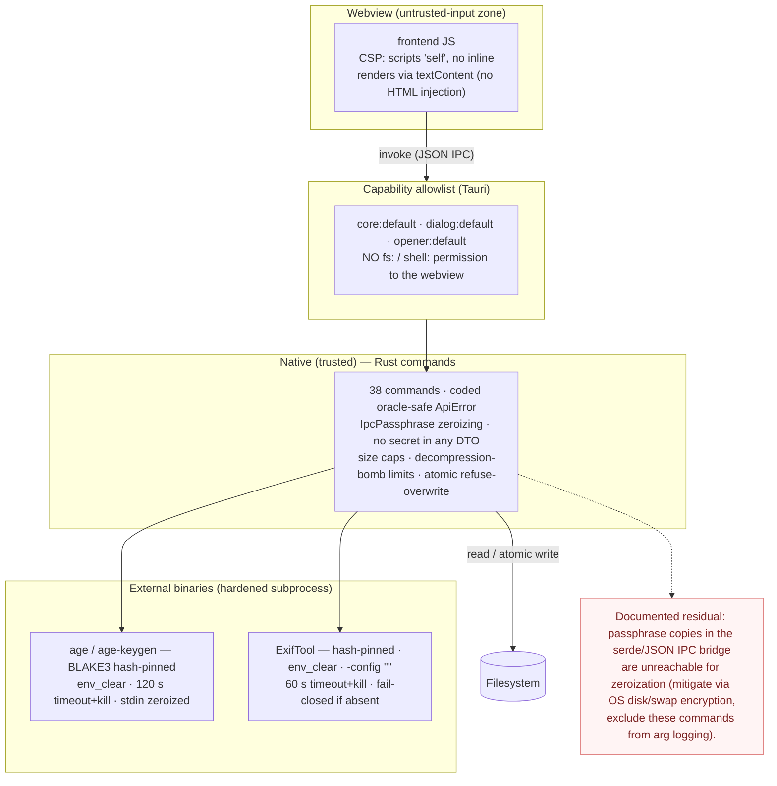

---

---

# Supporting figures

The eight figures below complete the diagram plan. They are *recommended where space allows* rather
than strictly required; each maps to a Supporting entry in the audit's plan.

## DIAG-06 — IPC Command Surface and Managed-State Map

*Type: component / interface mapping. Section: 4 Module Design (or appendix).*
The full IPC contract: 38 commands bucketed by the 5 managed states.

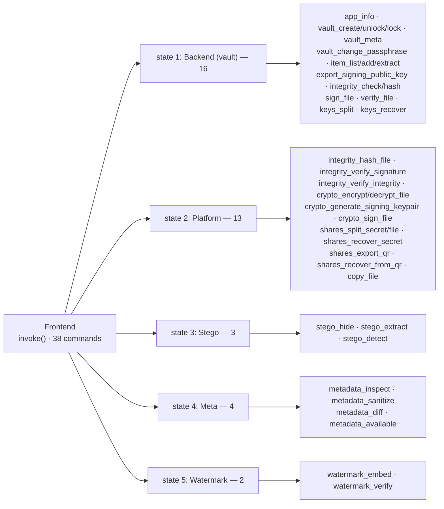

## DIAG-08 — Vault Header CBOR Data Model

*Type: UML class / ER. Section: 5 Data Design.*
Notation: `u8_16` = `[u8;16]`, `Vec_u8` = `Vec<u8>`, `Option_X` = `Option<X>` (sanitized for the
renderer). The `ItemDirectory` is **inside** the encrypted payload, not the header.

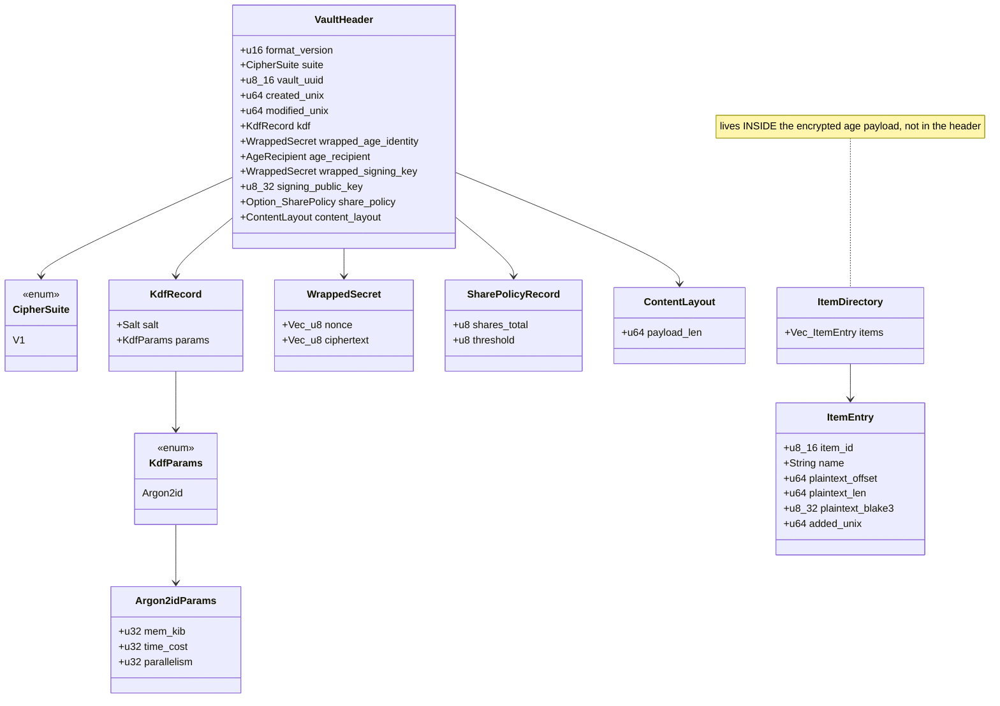

## DIAG-16 — Steganography Detection Fusion

*Type: activity / block. Section: 6 Processing Pipelines (D6 detail).*
A heuristic panel that never asserts "clean": the floor is `NotObserved` and every report carries a
"not proof" caveat. Fusion takes the **max** signal score.

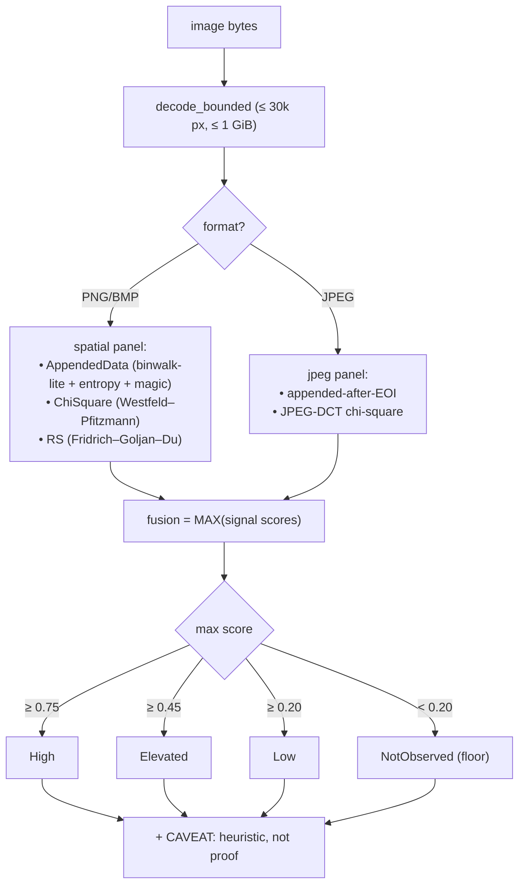

## DIAG-18 — Secure QR Transfer

*Type: UML sequence. Section: 6 Processing Pipelines (D5 detail).*
Pure-Rust codec; one piece string per QR (no chunking), EC-level H for scan robustness; fail-closed.

```mermaid
sequenceDiagram
    autonumber
    participant UI as Frontend
    participant P as PlatformCrypto
    participant QR as sv-qr (qrcode / rqrr)
    participant FS as Filesystem

    note over UI,FS: export (make QR)
    UI->>P: shares_export_qr(share_b64[], out_dir)
    loop each piece string (~124 ASCII)
        P->>QR: encode_text_to_png(text, path) — EC level H
        QR->>FS: write one PNG (over-capacity → TooLargeForQr)
    end
    P-->>UI: QrExportReport (paths)

    note over UI,FS: recover from QR
    UI->>P: shares_recover_from_qr(qr_paths[], payload_path, out_path)
    loop each QR image
        P->>QR: decode_png(path) — rqrr detect_grids
        QR-->>P: piece string (or NoQrFound / NotAnImage)
    end
    P->>P: recover_secret(pieces, payload) — Shamir combine + secretbox open
    P-->>UI: RecoverReport (output_path; no secret)
```

## DIAG-19 — Fragile Watermark Embed / Verify

*Type: activity. Section: 6 Processing Pipelines (D7 detail).*
Keyed BLAKE3-MAC over the upper-7-bit content of each 16×16 block, tiled into blue-channel LSBs, plus
a keyed presence sentinel in green-channel LSBs. PNG/BMP only; fragile by design.

```mermaid
flowchart TB
    subgraph EMB["watermark_embed"]
        m1["precheck: ≤ 256 MiB · PNG/BMP allowlist"] --> m2["refuse-existing · require lossless output"]
        m2 --> m3["Argon2id(passphrase, fixed salt) → WmKey"]
        m3 --> m4["load RGBA (bounded: ≤ 30k px, ≤ 1 GiB)"]
        m4 --> m5["per 16×16 block: tag = BLAKE3_keyed(K, ctx ‖ W ‖ H ‖ x0 ‖ y0 ‖ upper-7-bits)"]
        m5 --> m6["tile 256 tag bits → block blue-channel LSBs"]
        m6 --> m7["presence sentinel = BLAKE3_keyed(K, ctx ‖ W ‖ H) → green-channel LSBs"]
        m7 --> m8["save PNG / BMP"]
    end
    subgraph VER["watermark_verify"]
        v1["precheck · derive WmKey · load RGBA"] --> v2["recompute each block tag; compare to blue LSBs"]
        v2 --> v3{"presence matched / total ≥ 0.75 ?"}
        v3 -- "absent" --> nd["NotWatermarked<br/>(unmarked / wrong key / destroyed)"]
        v3 -- "present, 0 tampered" --> intact["Intact"]
        v3 -- "present, ≥ 1 block fails" --> tamp["Tampered (count reported)"]
    end
```

## DIAG-20 — Metadata Inspect / Sanitize / Compare

*Type: activity. Section: 6 Processing Pipelines (D8 detail).*
All three operations run through one hardened ExifTool subprocess; sanitize semantics are honest per
format and refuse rather than falsely claim success.

```mermaid
flowchart TB
    insp["metadata_inspect"] --> rj["-j -G -struct -fast2 → grouped tag report"]
    diff["metadata_diff(a,b)"] --> dd["embedded-tag diff<br/>(exclude File / ExifTool / Composite / System)"]
    san["metadata_sanitize(in,out)"] --> sup{"sanitize_support(file_type)"}
    sup -- "Native (images, A/V, raw)" --> nat["-all= -o OUTPUT (guaranteed)<br/>re-inspect before/after counts"]
    sup -- "Incremental (PDF)" --> pdf["strip, but prior metadata recoverable<br/>(guaranteed = false)"]
    sup -- "ReadOnly (Office, archives, …)" --> ro["refuse: Unsupported<br/>(never a false 'sanitized')"]
    rj --> HARD["Hardened subprocess (all ops):<br/>hash-pinned · env_clear + minimal PATH · -config &quot;&quot; (RCE closed)<br/>throwaway cwd · 60 s timeout+kill · ≤ 8 GiB input · stderr not echoed<br/>disabled ⇒ fail-closed Internal for every op"]
    dd --> HARD
    nat --> HARD
    pdf --> HARD
```

## DIAG-22 — Error → Coded `ApiError` Oracle-Safety Mapping

*Type: mapping / state. Section: 7 Security Architecture.*
How each domain error collapses onto the 12 stable `SV-*` codes; the deliberate merges keep the surface
oracle-safe (wrong-passphrase = wrong-share = `Unauthorized`; `Io` is path-stripped).

```mermaid
flowchart LR
    ve["VaultError"]
    pe["PlatformError"]
    me["MetaError"]
    se["StegoError"]
    qe["QrError"]
    we["WatermarkError"]

    un["Unauthorized"]
    co["Corrupted"]
    mal["Malformed"]
    iv["InvalidInput {detail}"]
    is["InsufficientShares {got,need}"]
    io["Io {detail} — path-stripped"]
    internal["Internal"]
    pass["NotFound · TooLarge · IncompatibleVersion · Timeout · OutputExists"]

    ve -->|"AuthFailed (wrong pass OR wrong share)"| un
    se -->|"NoPayload / BadFrame / AuthFailed (identical Display)"| un
    pe -->|"AuthFailed"| un
    ve -->|"signature / integrity fail"| co
    qe -->|"NoQrFound / NotAnImage"| mal
    me -->|"ExifToolFailed / Unsupported (stderr never echoed)"| iv
    we --> iv
    ve --> is
    pe --> is
    ve -->|"Io(_) redacted"| io
    pe -->|"Io(_) redacted"| io
    me -->|"BinaryNotFound / HashMismatch / Spawn (fail-closed)"| internal
    ve -->|"Crypto / Internal"| internal
    ve --> pass
    pe --> pass
    me --> pass
```

## DIAG-23 — Secret Lifecycle and Zeroization

*Type: data-flow / lifeline. Section: 7 Security Architecture.*
The no-secret-in-DTO invariant and the one acknowledged residual (passphrase copies in the serde/JSON
IPC bridge that cannot be reached for zeroization).

```mermaid
flowchart TB
    a["passphrase typed in UI<br/>(password input)"] --> b["JSON IPC bridge<br/>⚠ residual copies here (un-zeroizable)"]
    b --> c["IpcPassphrase(String)<br/>Drop zeroizes · Debug redacts"]
    c -->|"into_secret() — zeroizes source String"| d["SecretBytes<br/>(boxed slice, growth-proof, Drop zeroizes)"]
    d --> e["Argon2id"]
    e --> ff["Key32 (master / file key)<br/>Zeroize + ZeroizeOnDrop · redacted Debug · non-Serialize"]
    ff --> g["transient unwrapped secrets<br/>(age identity, signing key, archive)<br/>materialized per-op, zeroized after use"]
    ff --> h["RAM-only session map<br/>(removing entry wipes Key32)"]
    subgraph BOUND["IPC boundary invariant"]
        inv["no secret in any DTO<br/>(sv-types has zero crypto deps)<br/>SessionHandle is an opaque id only"]
    end
    h -.-> inv
    nt["UI password fields zeroed on navigation and after each task"]
    a -.-> nt
    classDef warn fill:#fff4f4,stroke:#e08585,color:#7a2222;
    class b warn;
    classDef nn fill:#f0f6ff,stroke:#88aacc,color:#223344;
    class nt,inv nn;
```

---

### Rendering notes

- All figures are Mermaid; preview in VS Code (Markdown Preview Mermaid Support), on GitHub, or via
  `mmdc` (mermaid-cli) to export SVG/PNG for the printed report.
- If your report toolchain is LaTeX/PlantUML-only, these translate directly: `flowchart`→component/
  activity, `sequenceDiagram`→UML sequence. Ask and I can emit a PlantUML variant.
- Supporting figures (DIAG-06/08/16/18/19/20/22/23) from the diagram plan can be added the same way.
