# Final Report Diagrams — PlantUML version

> PlantUML rendering of the same diagram set as [10-report-diagrams.md](10-report-diagrams.md)
> (Mermaid). Same DIAG numbers, same source-grounded content. Use whichever your report toolchain
> prefers; the Mermaid file is the canonical reference for the captions and facts.
>
> **Render:** `plantuml -tsvg 10-report-diagrams.plantuml.md` (PlantUML reads `@startuml` blocks
> directly), or paste a single `@startuml…@enduml` block into the PlantUML server / IDE plugin. Each
> block is independent.
>
> **Graphviz:** the component/class diagrams (01–06, 08, 22, 23) use Graphviz `dot` by default;
> sequence and activity diagrams (10–20) do not. If you don't have Graphviz installed, either
> `brew install graphviz`, or force the pure-Java engine with `-Playout=smetana` (or add
> `!pragma layout smetana` after `@startuml`). All 23 blocks were syntax-checked and rendered to SVG
> with PlantUML 1.2024.8 (Smetana), exit 0, no errors.
>
> Required set: DIAG-01/02/03/04/05/07/09/10/11/12/13/14/15/17/21. Supporting: 06/08/16/18/19/20/22/23.

---

## DIAG-01 — System Context

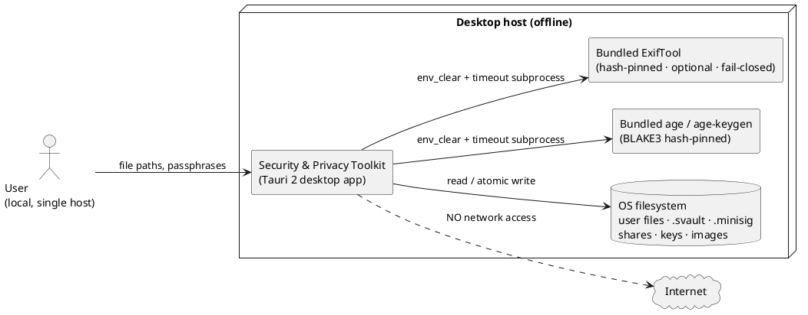

## DIAG-02 — Layered / Container Architecture

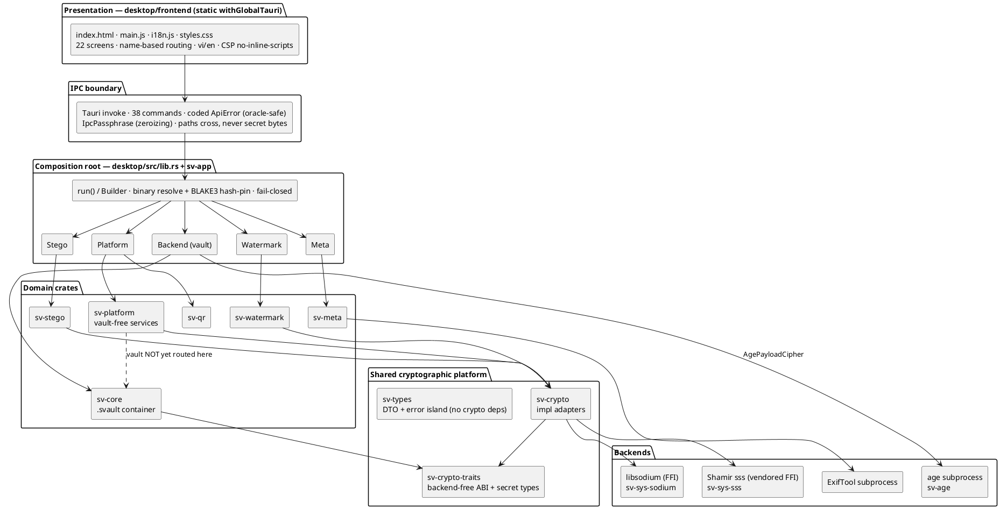

## DIAG-03 — Crate Dependency Graph

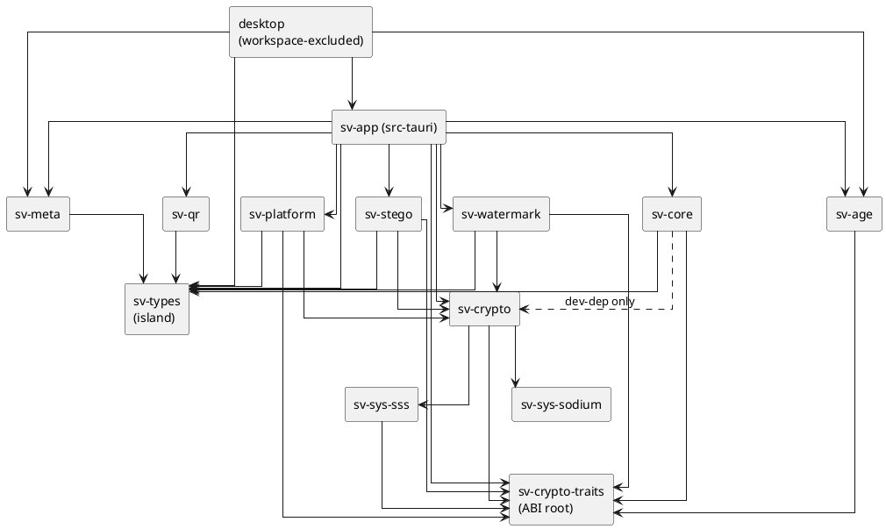

## DIAG-04 — Security-Domain Decomposition

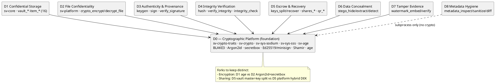

## DIAG-05 — Cryptographic Primitive Stack (trait → impl → backend)

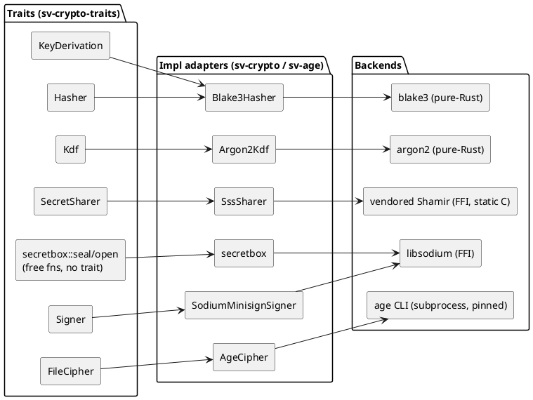

## DIAG-07 — `.svault` Container Byte-Layout

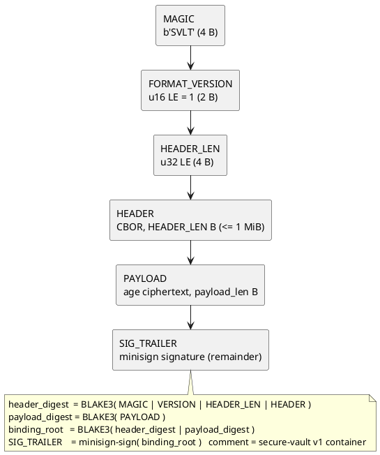

## DIAG-09 — Vault Key Hierarchy

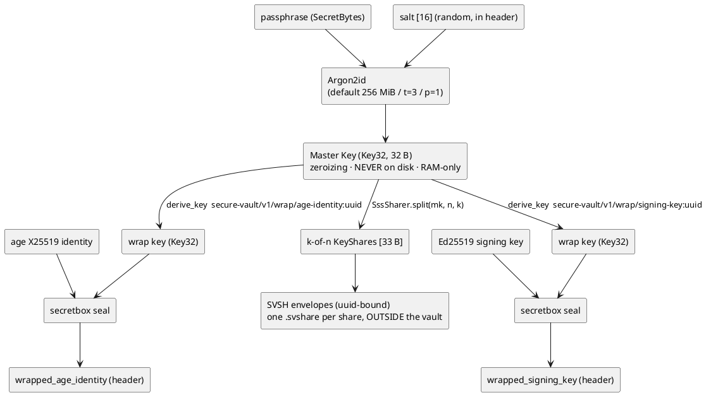

## DIAG-10 — Vault Create / Seal

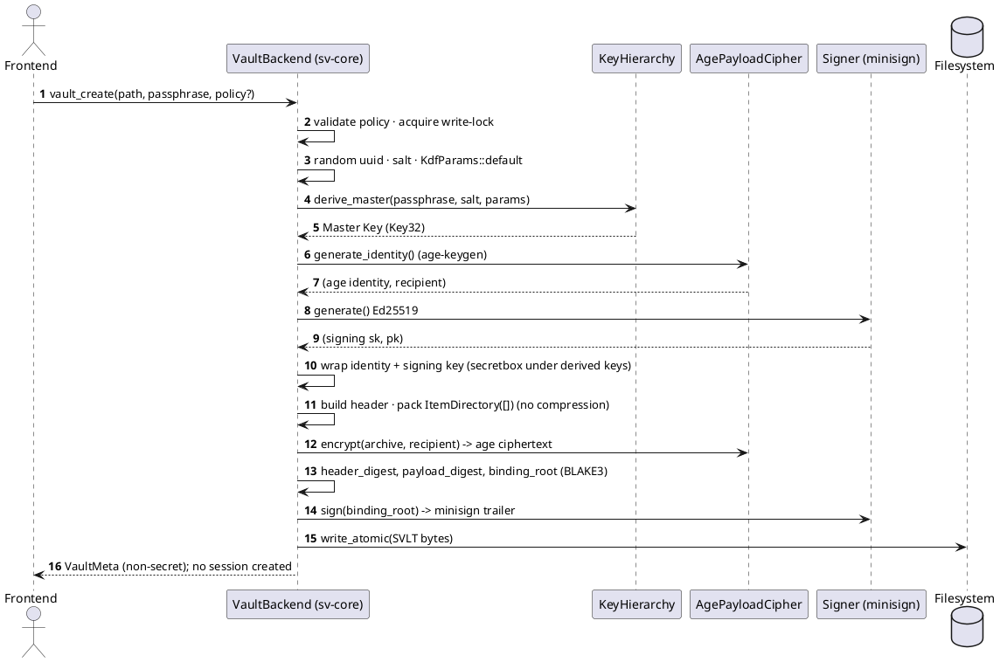

## DIAG-11 — Vault Unlock / Unseal (oracle-safe ordering)

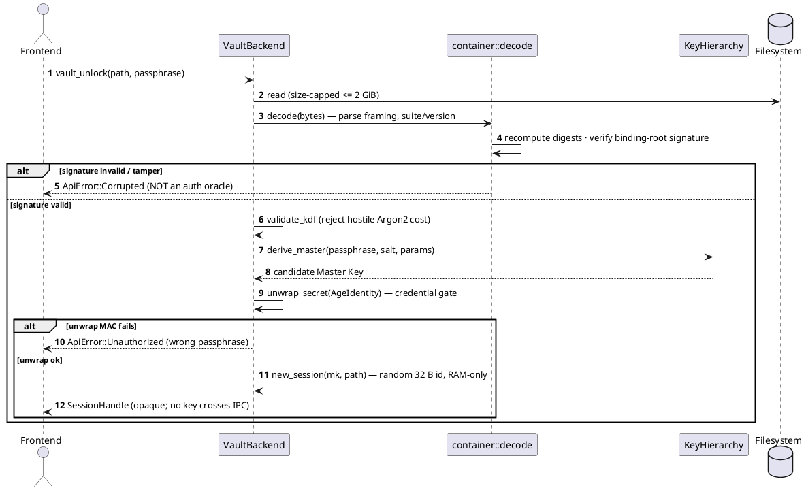

## DIAG-12 — Standalone File Encrypt / Decrypt (D2 — Argon2id + secretbox)

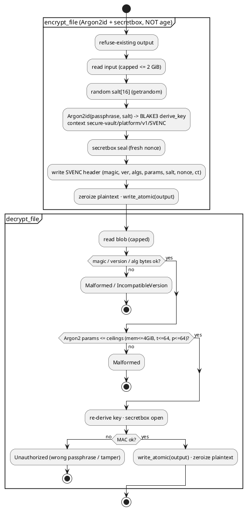

## DIAG-13 — Digital Signature: keygen → sign → verify (D3)

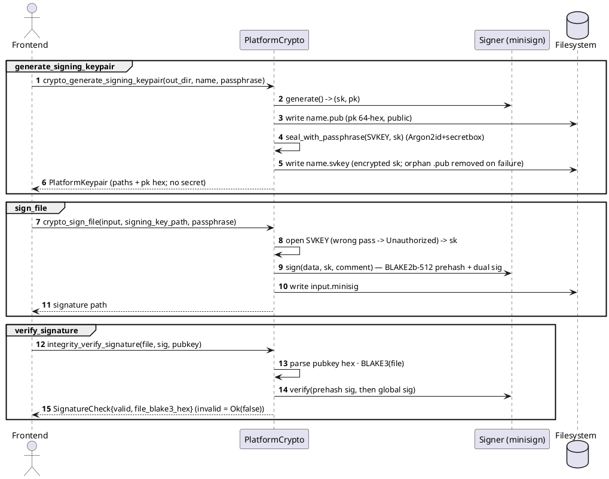

## DIAG-14 — Integrity Verification Decision Flow (D4)

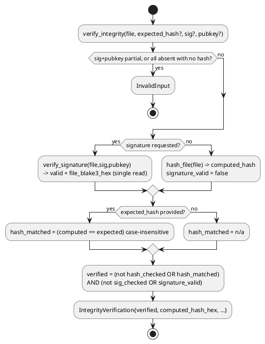

## DIAG-15 — Steganography Embed / Extract Data-Flow (D6)

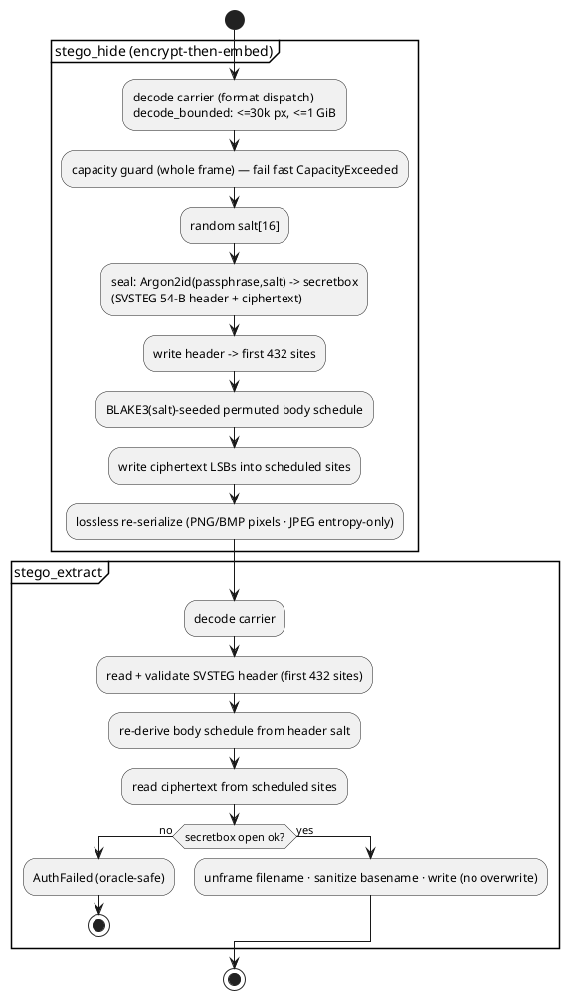

## DIAG-17 — Secret Sharing & Recovery — two pipelines (D5)

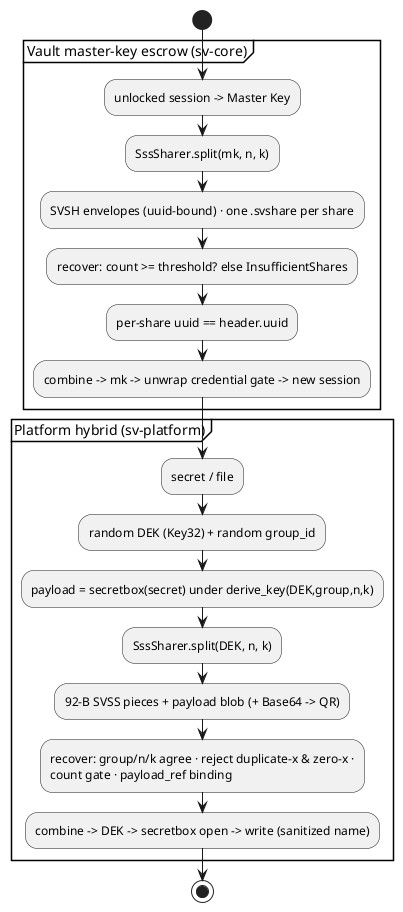

## DIAG-21 — Trust Boundaries & Subprocess Hardening

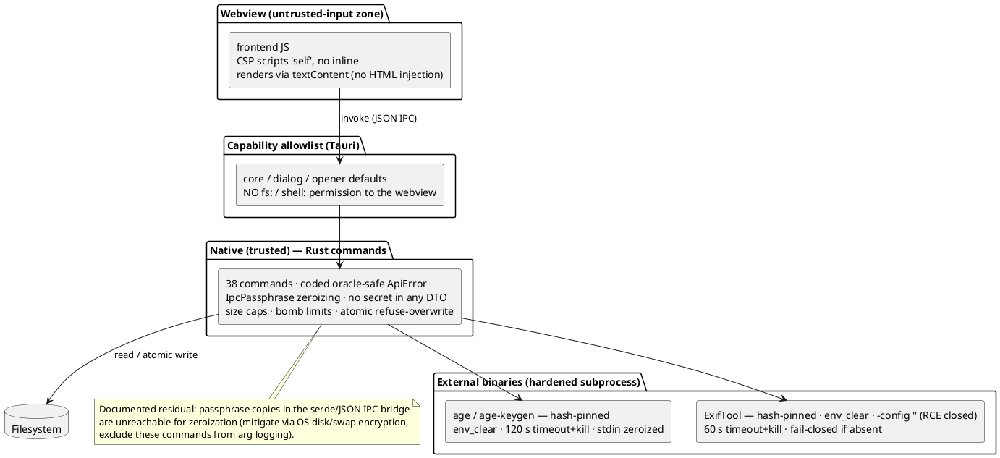

---

# Supporting figures

## DIAG-06 — IPC Command Surface & Managed-State Map

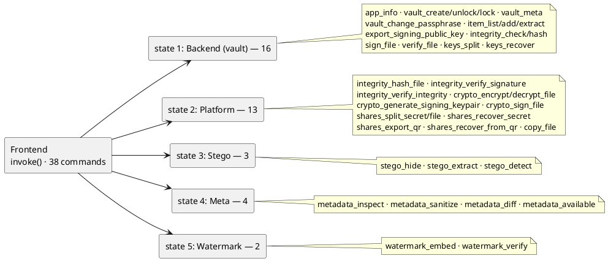

## DIAG-08 — Vault Header CBOR Data Model

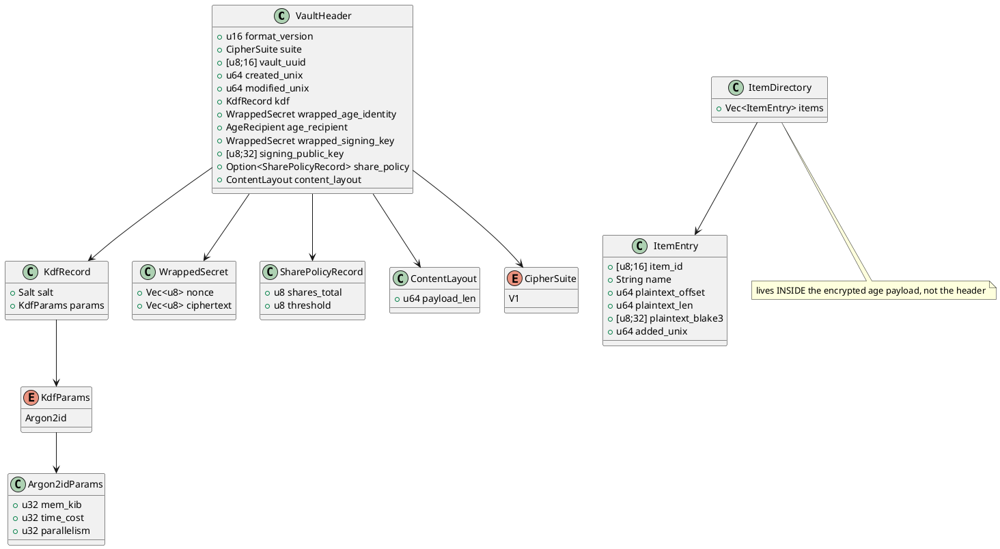

## DIAG-16 — Steganography Detection Fusion

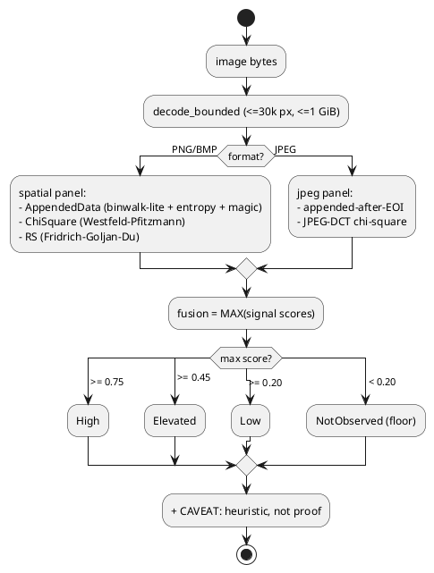

## DIAG-18 — Secure QR Transfer

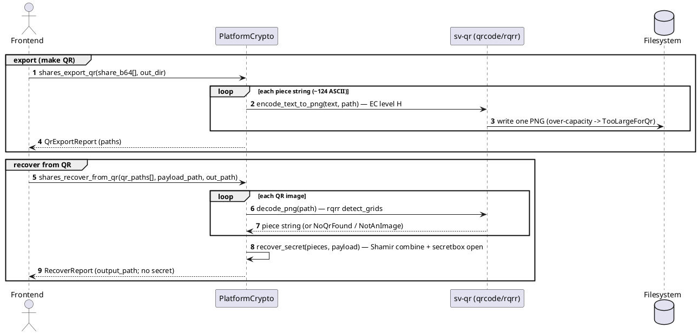

## DIAG-19 — Fragile Watermark Embed / Verify

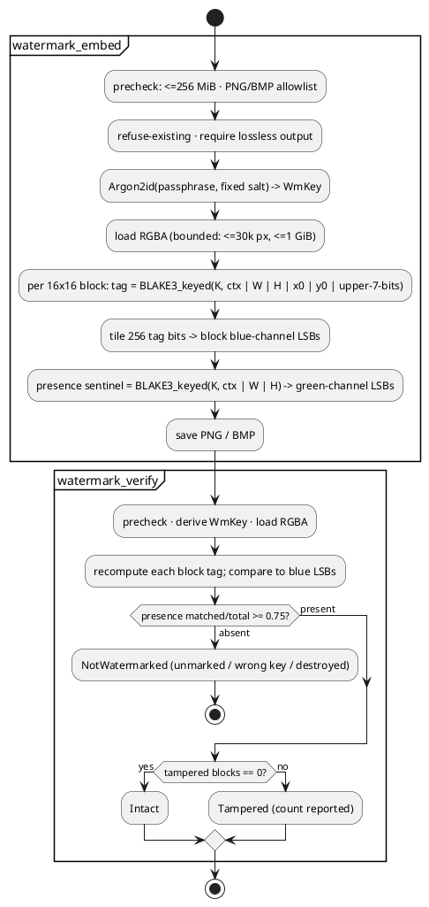

## DIAG-20 — Metadata Inspect / Sanitize / Compare

```plantuml
@startuml
start
:metadata op (inspect / sanitize / diff);
note right
Hardened subprocess (all ops):
hash-pinned · env_clear + minimal PATH · -config '' (RCE closed)
throwaway cwd · 60 s timeout+kill · <=8 GiB input · stderr not echoed
disabled => fail-closed Internal for every op
end note
if (operation?) then (inspect)
  :-j -G -struct -fast2 -> grouped tag report;
elseif (operation = diff?) then (diff)
  :embedded-tag diff (exclude File/ExifTool/Composite/System);
else (sanitize)
  switch (sanitize_support(file_type)?)
  case (Native: images, A/V, raw)
    :-all= -o OUTPUT (guaranteed) · re-inspect before/after;
  case (Incremental: PDF)
    :strip, but prior metadata recoverable (guaranteed=false);
  case (ReadOnly: Office, archives)
    :refuse: Unsupported (never a false 'sanitized');
  endswitch
endif
stop
@enduml
```

## DIAG-22 — Error → Coded `ApiError` Oracle-Safety Mapping

```plantuml
@startuml
left to right direction
rectangle "VaultError" as ve
rectangle "PlatformError" as pe
rectangle "MetaError" as me
rectangle "StegoError" as se
rectangle "QrError" as qe
rectangle "WatermarkError" as we
rectangle "Unauthorized" as un
rectangle "Corrupted" as co
rectangle "Malformed" as mal
rectangle "InvalidInput{detail}" as iv
rectangle "InsufficientShares{got,need}" as is
rectangle "Io{detail} — path-stripped" as io
rectangle "Internal" as internal
rectangle "NotFound · TooLarge · IncompatibleVersion · Timeout · OutputExists" as pass
ve --> un : AuthFailed (wrong pass OR wrong share)
se --> un : NoPayload / BadFrame / AuthFailed (identical Display)
pe --> un : AuthFailed
ve --> co : signature / integrity fail
qe --> mal : NoQrFound / NotAnImage
me --> iv : ExifToolFailed / Unsupported (stderr never echoed)
we --> iv
ve --> is
pe --> is
ve --> io : Io(_) redacted
pe --> io : Io(_) redacted
me --> internal : BinaryNotFound / HashMismatch / Spawn (fail-closed)
ve --> internal : Crypto / Internal
ve --> pass
pe --> pass
me --> pass
@enduml
```

## DIAG-23 — Secret Lifecycle & Zeroization

```plantuml
@startuml
top to bottom direction
rectangle "passphrase typed in UI (password input)" as A
rectangle "JSON IPC bridge\n(residual copies here — un-zeroizable)" as B
rectangle "IpcPassphrase(String)\nDrop zeroizes · Debug redacts" as C
rectangle "SecretBytes\n(boxed slice, growth-proof, Drop zeroizes)" as D
rectangle "Argon2id" as E
rectangle "Key32 (master / file key)\nZeroize + ZeroizeOnDrop · redacted Debug · non-Serialize" as F
rectangle "transient unwrapped secrets\n(age identity, signing key, archive)\nper-op, zeroized after use" as G
rectangle "RAM-only session map\n(removing entry wipes Key32)" as H
rectangle "IPC boundary invariant:\nno secret in any DTO (sv-types has zero crypto deps)\nSessionHandle is an opaque id only" as INV
A --> B
B --> C
C --> D : into_secret() — zeroizes source String
D --> E
E --> F
F --> G
F --> H
H ..> INV
note bottom of A : UI password fields zeroed on navigation and after each task
@enduml
```
